# AWS Bedrock AgentCore Deep Dive

*မူရင်းဆောင်းပါး - [AWS Bedrock AgentCore Deep Dive](https://joudwawad.medium.com/aws-bedrock-agentcore-deep-dive-6822e4071774#f704) (By Joud W. Awad)*

ဒီ post ရဲ့ video version ကို ကြည့်ချင်တယ်ဆိုရင်တော့ YouTube video မှာ သွားရောက်ကြည့်ရှုနိုင်ပါတယ်ဗျာ။ စာဖတ်ပြီး အသေးစိတ်လေ့လာချင်ရင်တော့ အောက်မှာ ဆက်လက်ဖတ်ရှုနိုင်ပါတယ်!

[YouTube Video](https://www.youtube.com/watch?v=P6mUa4F-JU4)

ပြီးခဲ့တဲ့ post မှာ ကျွန်တော်တို့ AWS Cloud ပေါ်မှာ LLMs နဲ့ Agents တွေကို တည်ဆောက်ပြီး host လုပ်ပေးနိုင်တဲ့ AWS service တစ်ခုဖြစ်တဲ့ [AWS Bedrock](https://medium.com/@joudwawad/aws-bedrock-deep-dive-361439290ebd) အကြောင်းကို အသေးစိတ် ဆွေးနွေးခဲ့ကြပြီးပြီဖြစ်ပါတယ်ဗျာ။

ဒီ post မှာတော့ ကျွန်တော်တို့ Amazon Bedrock AgentCore အကြောင်းကို ဆွေးနွေးသွားမှာ ဖြစ်ပါတယ်ဗျာ။ သူကတော့ AWS Bedrock ရဲ့ sub-service တစ်ခုဖြစ်ပြီး **"ဘယ် framework နဲ့ model ကိုမဆို သုံးပြီး"** လုံလုံခြုံခြုံနဲ့ စိတ်ချရတဲ့ agent တွေကို အတိုင်းအတာကြီးကြီးမားမား (at scale) deploy လုပ်ပြီး operate လုပ်နိုင်အောင် ကူညီပေးတာ ဖြစ်ပါတယ်ဗျာ။ Amazon Bedrock AgentCore ကို သုံးခြင်းအားဖြင့် developer တွေအနေနဲ့ AI agents တွေကို real-world deployment မှာ အလွန်အရေးကြီးတဲ့ scale, reliability နဲ့ security အပြည့်နဲ့ production ထဲကို လျင်လျင်မြန်မြန် ထည့်သွင်းနိုင်မှာ ဖြစ်ပါတယ်လေ။

AWS Bedrock AgentCore က agents တွေကို ပိုပြီး ထိရောက်စေမယ့် tools နဲ့ capabilities တွေ၊ လုံခြုံစွာ scale လုပ်နိုင်မယ့် purpose-built infrastructure တွေနဲ့ ယုံကြည်စိတ်ချရတဲ့ agent တွေအဖြစ် run နိုင်မယ့် controls တွေကို ပံ့ပိုးပေးထားပါတယ်ဗျာ။ ပြီးတော့ ဒီ services တွေက composable ဖြစ်ပြီး နာမည်ကြီး open-source frameworks တွေ၊ ဘယ် model နဲ့မဆို တွဲသုံးနိုင်တာမို့လို့ open-source ရဲ့ flexibility နဲ့ enterprise-grade security/reliability နှစ်ခုလုံးကို တစ်ပြိုင်နက် ရရှိစေမှာ ဖြစ်ပါတယ်ဗျာ။

### Table Of Content (မာတိကာ)

· [Services in Amazon Bedrock AgentCore](#services-in-amazon-bedrock-agentcore)
· [Amazon Bedrock AgentCore Runtime: Host agent or tools](#amazon-bedrock-agentcore-runtime-host-agent-or-tools)
· [Deploying an “AI Agent” with Bedrock AgentCore Runtime](#deploying-an-ai-agent-with-bedrock-agentcore-runtime)
 ∘ [What happens behind the scenes?](#what-happens-behind-the-scenes)
 ∘ [1) /invocations — POST](#1-invocations--post)
 ∘ [2) /ping — GET](#2-ping--get)
· [Deploying an “MCP Server” with Bedrock AgentCore Runtime](#deploying-an-mcp-server-with-bedrock-agentcore-runtime)
 ∘ [/mcp — POST](#mcp--post)
· [Deploying an “A2A Servers” with Bedrock AgentCore Runtime](#deploying-an-a2a-servers-with-bedrock-agentcore-runtime)
· [Use isolated sessions for agents](#use-isolated-sessions-for-agents)
 ∘ [Understanding ephemeral context](#understanding-ephemeral-context)
 ∘ [How to use sessions](#how-to-use-sessions)
 ∘ [Stop a running session](#stop-a-running-session)
· [Handle asynchronous and long-running agents with Amazon Bedrock AgentCore Runtime](#handle-asynchronous-and-long-running-agents-with-amazon-bedrock-agentcore-runtime)
 ∘ [Asynchronous processing model](#asynchronous-processing-model)
 ∘ [Runtime session lifecycle management](#runtime-session-lifecycle-management)
 ∘ [Asynchronous task decorator](#asynchronous-task-decorator)
· [AgentCore Runtime LifeCycle Events](#agentcore-runtime-lifecycle-events)
· [AgentCore Runtime versioning and endpoints](#agentcore-runtime-versioning-and-endpoints)
· [Amazon Bedrock AgentCore Memory: Add memory to your Agent](#amazon-bedrock-agentcore-memory-add-memory-to-your-agent)
· [Memory types](#memory-types)
 ∘ [1) Short-term memory](#1-short-term-memory)
 ∘ [2) Long-term memory](#2-long-term-memory)
 ∘ [Memory terminology](#memory-terminology)
 ∘ [Memory Architecture](#memory-architecture)
· [Memory strategies](#memory-strategies)
· [Built-in strategies](#built-in-strategies)
 ∘ [1) Semantic memory strategy](#1-semantic-memory-strategy)
 ∘ [2) User preference memory strategy](#2-user-preference-memory-strategy)
 ∘ [3) Summary strategy](#3-summary-strategy)
· [AgentCore Memory Integration](#agentcore-memory-integration)
· [Advance AgentCore Memory Pattern: Memory Branching](#advance-agentcore-memory-pattern-memory-branching)
· [Example Architecture](#example-architecture)
 ∘ [Key Benefits for Multi-Agent Systems:](#key-benefits-for-multi-agent-systems)
 ∘ [How the Memory Hook Provider with Branch Support Works](#how-the-memory-hook-provider-with-branch-support-works)
 ∘ [Building the Agent Graph with Parallel Execution Support](#building-the-agent-graph-with-parallel-execution-support)
· [Amazon Bedrock AgentCore Identity: Provide identity management for agent applications](#amazon-bedrock-agentcore-identity-provide-identity-management-for-agent-applications)
· [Authentication Types](#authentication-types)
 ∘ [Inbound Auth](#inbound-auth)
 ∘ [Outbound Auth](#outbound-auth)
 ∘ [How It Works](#how-it-works)
· [Tagging AgentCore Identity resources](#tagging-agentcore-identity-resources)
 ∘ [Control access based on tags](#control-access-based-on-tags)
· [Amazon Bedrock AgentCore Gateway: Securely connect tools and other resources to your Gateway](#amazon-bedrock-agentcore-gateway-securely-connect-tools-and-other-resources-to-your-gateway)
 ∘ [Available outbound authorization for the gateway](#available-outbound-authorization-for-the-gateway)
 ∘ [Core Concepts](#core-concepts)
 ∘ [Implement Lambda function tools for Gateway](#implement-lambda-function-tools-for-gateway)
· [Gateway Semantic Search](#gateway-semantic-search)
· [Amazon Bedrock AgentCore Built-in Tools: Interact with your applications using built-in tools](#amazon-bedrock-agentcore-built-in-tools-interact-with-your-applications-using-built-in-tools)
· [Execute code and analyze data using Amazon Bedrock AgentCore Code Interpreter](#execute-code-and-analyze-data-using-amazon-bedrock-agentcore-code-interpreter)
 ∘ [Why use Code Interpreter in agent development](#why-use-code-interpreter-in-agent-development)
· [Interact with web applications using Amazon Bedrock AgentCore Browser](#interact-with-web-applications-using-amazon-bedrock-agentcore-browser)
 ∘ [How it works](#how-it-works-1)
· [Amazon Bedrock AgentCore Observability: Observe your agents and resources](#amazon-bedrock-agentcore-observability-observe-your-agents-and-resources)
 ∘ [AgentCore Gateway CloudWatch Tracing](#agentcore-gateway-cloudwatch-tracing)

---

## Services in Amazon Bedrock AgentCore

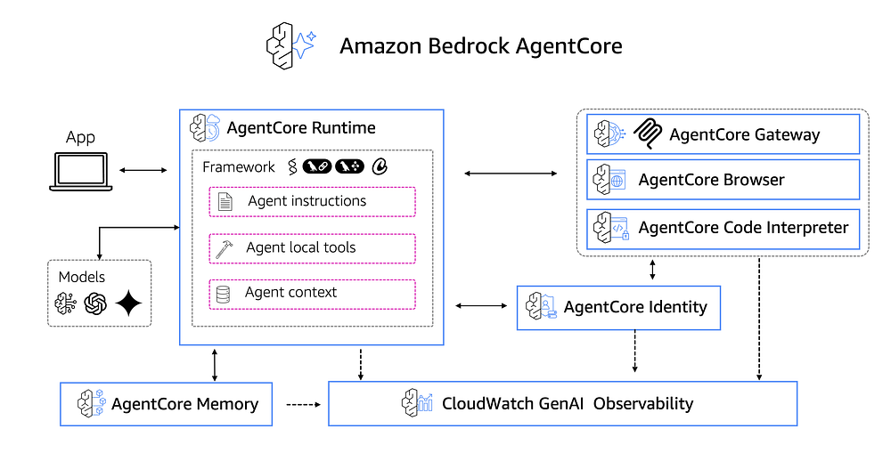

Amazon Bedrock AgentCore မှာ တစ်ခုချင်းစီ သီးခြားခွဲသုံးလို့ရသလို၊ အတူတူတွဲသုံးလို့လည်းရတဲ့ modular **Services** တွေ ပါဝင်ပါတယ်ဗျာ။

* **Amazon Bedrock AgentCore Runtime:** သူကတော့ AI agents နဲ့ tools တွေကို run ပေးမယ့် လုံခြုံစိတ်ချရတဲ့ *serverless* ပတ်ဝန်းကျင်တစ်ခုပဲ ဖြစ်ပါတယ်ဗျာ။ ဘယ် framework, protocol သို့မဟုတ် model နဲ့မဆို အလုပ်လုပ်တာမို့လို့ idea တွေကို စမ်းသပ်ဖို့နဲ့ AI solutions တွေကို production ထဲ လျင်မြန်စွာ ရောက်ရှိစေဖို့ အထောက်အကူပြုပါတယ်လေ။
* **Identity:** Agent တွေရဲ့ login နဲ့ access systems တွေကို စီမံခန့်ခွဲပေးတာ ဖြစ်ပါတယ်ဗျ။ AWS services တွေအပြင် Slack, Zoom, Okta, Entra, Amazon Cognito စတဲ့ third-party applications/identity providers တွေနဲ့ အလွယ်တကူ ချိတ်ဆက်ပေးနိုင်ပါတယ်ဗျာ။
* **Memory:** ကျွန်တော်တို့ရဲ့ AI agents တွေကို မှတ်ဉာဏ် (memory) ထည့်ပေးတဲ့ service ဖြစ်ပါတယ်ဗျာ။ အချက်အလက်တွေကို သိမ်းဆည်းဖို့နဲ့ ပြန်လည်ခေါ်ယူဖို့အတွက် fully managed infrastructure ကို ပံ့ပိုးပေးတာမို့လို့ user တွေအတွက် context-aware ဖြစ်ပြီး ပိုပြီး ကောင်းမွန်တဲ့ experience ကို ပေးနိုင်မှာ ဖြစ်ပါတယ်လေ။
* **Tools:** Agent တွေရဲ့ စွမ်းဆောင်ရည်ကို မြှင့်တင်ပေးမယ့် built-in tools နှစ်ခု ပါဝင်ပါတယ်ဗျာ။
 — **Code Interpreter:** Agent တွေကို လုံခြုံတဲ့ ပတ်ဝန်းကျင်မှာ code ရေးပြီး run နိုင်အောင် လုပ်ဆောင်ပေးပြီး complex problems တွေကို ဖြေရှင်းစေနိုင်ပါတယ်ဗျာ။
 — **Browser Tool:** လုံခြုံတဲ့ sandbox environment ထဲကနေ web ဖတ်တာ၊ form ဖြည့်တာ စတဲ့ အလုပ်တွေကို လုပ်ဆောင်စေနိုင်ပါတယ်ဗျာ။
* **Gateway:** Agent တွေကို real-world systems တွေနဲ့ ချိတ်ဆက်ရလွယ်ကူအောင် ကူညီပေးပါတယ်ဗျ။ API တွေ၊ AWS Lambda functions တွေနဲ့ အခြား services တွေကို agent သုံးလို့ရမယ့် tools တွေအဖြစ် အလိုအလျောက် ပြောင်းလဲပေးနိုင်ပါတယ်ဗျာ။
* **Observability:** Agent တွေရဲ့ performance ကို monitor လုပ်ဖို့ ကူညီပေးပါတယ်ဗျာ။ Dashboards တွေ၊ OpenTelemetry သုံးထားတဲ့ metrics နဲ့ tracing တွေ ပါဝင်တာမို့လို့ ပြဿနာတွေကို မြန်မြန်ရှာပြီး ဖြေရှင်းနိုင်မှာ ဖြစ်ပါတယ်လေ။

ဒီ services တွေကို သီးခြားစီဖြစ်စေ၊ ပေါင်းပြီးဖြစ်စေ သုံးနိုင်ပြီး Strands Agents, LangChain, LangGraph သို့မဟုတ် CrewAI စတဲ့ ဘယ် framework၊ ဘယ် model နဲ့မဆို လိုက်ဖက်ညီညီ သုံးနိုင်ပါတယ်ဗျာ။

---

## Amazon Bedrock AgentCore Runtime: Host agent or tools

AgentCore Runtime ဆိုတာကတော့ ကျွန်တော်တို့ရဲ့ AI agent သို့မဟုတ် tool ရဲ့ code ကို host လုပ်ပေးတဲ့ အဓိက အခြေခံ component ဖြစ်ပါတယ်ဗျာ။ သူကတော့ အောက်ပါအချက်တွေကို လုပ်ဆောင်ပေးတဲ့ **containerized application** တစ်ခုဖြစ်ပါတယ် -

* User inputs တွေကို process လုပ်ပေးခြင်း
* Context (ပတ်ဝန်းကျင် အချက်အလက်) တွေကို ထိန်းသိမ်းပေးခြင်း
* AI capabilities တွေကို သုံးပြီး action တွေကို execute လုပ်ပေးခြင်း

ဥပမာအားဖြင့်၊ customer support agent တစ်ခုဆိုရင် product မေးခွန်းတွေကို ဖြေတာ၊ ပြန်အမ်းငွေ process လုပ်တာနဲ့ လိုအပ်ရင် human representative ဆီ လွှဲပေးတာတွေကို လုပ်ဆောင်ပေးနိုင်ပါတယ်ဗျာ။

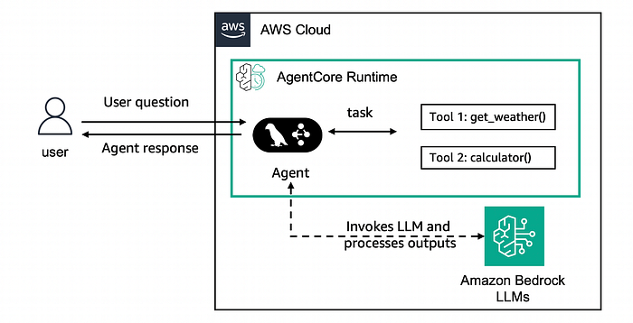

Developer တွေအနေနဲ့ code ကိုရေးပြီး decorator တွေကို သုံးပြီး features တွေကို ထည့်သွင်းနိုင်ပါတယ်ဗျ။ ပြီးရင်တော့ လိုင်းအနည်းငယ်နဲ့ပဲ deploy လုပ်နိုင်ပါတယ်ဗျာ။

AgentCore က သင့် code ကို Docker image အဖြစ် အလိုအလျောက် package လုပ်ပြီး၊ **Amazon ECR (Elastic Container Registry)** ထဲကို push လုပ်ကာ၊ **Serverless Runtime Environment** ပေါ်မှာ deploy လုပ်ပေးသွားမှာ ဖြစ်ပါတယ်ဗျာ။ ဒီ runtime က workload ပေါ်မူတည်ပြီး auto-scale လုပ်ပေးသလို၊ agent တစ်ခုစီအတွက် invoke လုပ်ဖို့ endpoint တစ်ခုစီလည်း ထုတ်ပေးပါတယ်လေ။

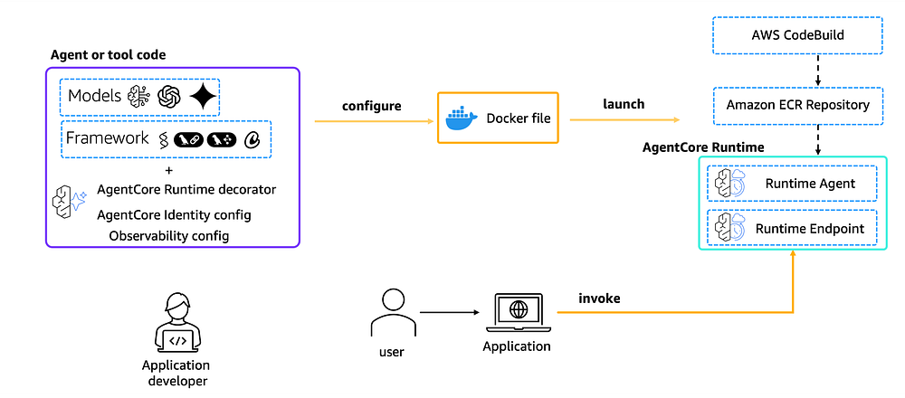

Amazon Bedrock AgentCore Runtime ဟာ [AWS Lambda](https://medium.com/@joudwawad/aws-lambda-architecture-deep-dive-bef856b9b2c4) လိုမျိုး အလုပ်လုပ်တာ ဖြစ်ပါတယ်ဗျာ။ Request တစ်ခုဝင်လာရင် lightweight ဖြစ်တဲ့ **microVM** တစ်ခုကို **spot EC2 instance** ပေါ်မှာ စတင်တည်ဆောက်ပြီး၊ သတ်မှတ်ထားတဲ့ Docker image ကို သုံးပြီး request handler ကို invoke လုပ်ပေးပါတယ်ဗျာ။

ဒီ microVM က session (user နဲ့ agent အကြား စကားပြောဆိုမှု) ပြီးဆုံးတဲ့အထိ တက်နေမှာဖြစ်လို့ နောက်ထပ်ဝင်လာမယ့် request တွေကို ပိုမိုမြန်ဆန်စွာ ဆောင်ရွက်ပေးနိုင်မှာ ဖြစ်ပါတယ်ဗျာ။ Session ပြီးသွားရင်တော့ runtime က resource တွေကို အလိုအလျောက် ပြန်လည်သိမ်းဆည်းသွားမှာ ဖြစ်ပါတယ်လေ။

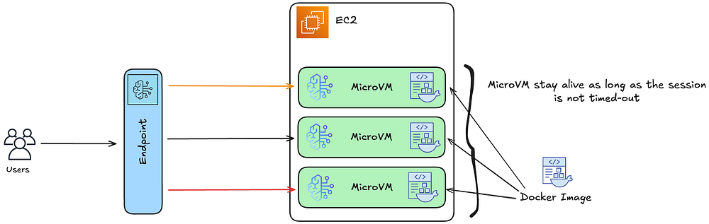

AgentCore Runtime က resource တွေကို အောက်ပါအတိုင်း စီမံပေးပါတယ်ဗျာ -

* **On-demand provisioning:** Request ဝင်လာမှ compute resources ကို dynamically တည်ဆောက်ပါတယ်။
* **Session management:** Request တစ်ခုချင်းစီကို သီးခြားခွဲထုတ်ထားတဲ့ microVM ထဲမှာ run လို့ လုံခြုံစိတ်ချရပါတယ်။
* **Auto-scaling:** Concurrent requests တွေအလိုက် အလိုအလျောက် scale လုပ်ပေးပါတယ်။
* **Resource optimization:** Spot instances တွေကို သုံးပြီး compute cost ကို အတတ်နိုင်ဆုံး လျှော့ချပေးပါတယ်ဗျာ။

## Deploying an “AI Agent” with Bedrock AgentCore Runtime

ပုံမှန်အားဖြင့် cloud ပေါ်မှာ Agent တစ်ခုကို deploy လုပ်ဖို့ဆိုရင် လုပ်ငန်းစဉ်တွေ အများကြီး လိုအပ်ပါတယ်ဗျာ။ ဒါပေမယ့် AgentCore Runtime ကို သုံးရင်တော့ code အနည်းငယ်နဲ့ အလွယ်တကူ host လုပ်နိုင်ပါတယ်လေ။

အောက်က ဥပမာလေးကတော့ AWS Bedrock ပေါ်မှာ host လုပ်ထားတဲ့ LLM model ကိုသုံးပြီး agent တစ်ခု ဆောက်ပြထားတာ ဖြစ်ပါတယ်ဗျာ -

```python
from strands import Agent, tool
from strands_tools import calculator # Import the calculator tool
import argparse
import json
from bedrock_agentcore.runtime import BedrockAgentCoreApp
from strands.models import BedrockModel

app = BedrockAgentCoreApp()

# Create a custom tool 
@tool
def weather():
    """ Get weather """ # Dummy implementation
    return "sunny"


model_id = "us.anthropic.claude-3-7-sonnet-20250219-v1:0"
model = BedrockModel(
    model_id=model_id,
)
agent = Agent(
    model=model,
    tools=[calculator, weather],
    system_prompt="You're a helpful assistant. You can do simple math calculation, and tell the weather."
)

@app.entrypoint
def strands_agent_bedrock(payload):
    """
    Invoke the agent with a payload
    """
    user_input = payload.get("prompt")
    print("User input:", user_input)
    response = agent(user_input)
    return response.message['content'][0]['text']

if __name__ == "__main__":
    app.run()
```

Amazon Bedrock AgentCore Python SDK က သင့်ရဲ့ agent functions တွေကို Amazon Bedrock နဲ့ ကိုက်ညီတဲ့ HTTP services တွေအဖြစ် ပြောင်းလဲပေးတဲ့ lightweight wrapper ဖြစ်ပါတယ်ဗျ။ HTTP server configuration တွေကို သူက အကုန်ကိုင်တွယ်ပေးလို့ developer အနေနဲ့ agent ရဲ့ အဓိက logic ပေါ်မှာပဲ အာရုံစိုက်နိုင်ပါတယ်ဗျာ။

သင့်လုပ်ဆောင်ရမှာက `@app.entrypoint` decorator ကို သုံးဖို့နဲ့ configure/launch လုပ်ဖို့ပဲ လိုအပ်ပြီး၊ ဒီ code က အောက်ပါ architecture အတိုင်း deploy လုပ်ပေးသွားမှာ ဖြစ်ပါတယ်ဗျာ -

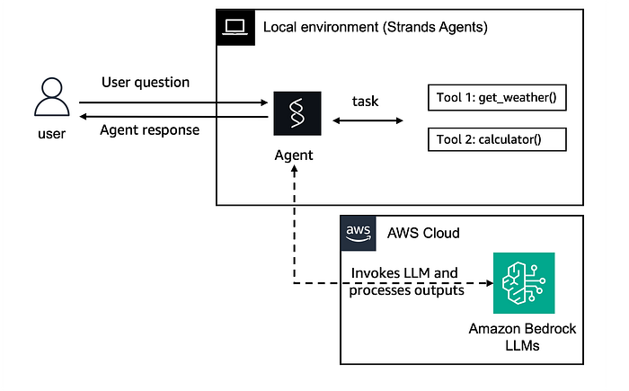

### နောက်ကွယ်မှာ ဘာတွေဖြစ်ပျက်နေသလဲ?

`BedrockAgentCoreApp` ကို သုံးတဲ့အခါ အောက်ပါအချက်တွေကို အလိုအလျောက် လုပ်ဆောင်ပေးပါတယ်ဗျာ -

* Port 8080 ပေါ်မှာ နားထောင်မယ့် HTTP server တစ်ခု ဆောက်ပေးခြင်း
* Request တွေကို process လုပ်ဖို့ `/invocations` endpoint ကို တည်ဆောက်ပေးခြင်း
* Health check လုပ်ဖို့ `/ping` endpoint ကို တည်ဆောက်ပေးခြင်း (ဒါက asynchronous agents တွေအတွက် အင်မတန် အရေးကြီးပါတယ်ဗျာ)
* Content types နဲ့ response formats တွေကို ကိုင်တွယ်ပေးခြင်း
* AWS standards အတိုင်း error handling လုပ်ပေးခြင်း

### 1) /invocations — POST

ဒီ endpoint က JSON input လက်ခံပြီး JSON/SSE output ပြန်ပေးတဲ့ အဓိက interaction endpoint ဖြစ်ပါတယ်ဗျာ။ အသုံးပြုသူ သို့မဟုတ် applications တွေဆီကလာတဲ့ request တွေကို လက်ခံပြီး agent ရဲ့ business logic နဲ့ process လုပ်ပေးပါတယ်လေ။

ဒီ `/invocations` endpoint ရဲ့ ရည်ရွယ်ချက်တွေကတော့ -
* User နဲ့ တိုက်ရိုက် စကားပြောဆို ဆက်သွယ်ခြင်း
* External systems တွေနဲ့ API integrations ပြုလုပ်ခြင်း
* Requests အများကြီးကို Batch processing လုပ်ခြင်း
* အချိန်ကြာမြင့်မယ့် အလုပ်တွေအတွက် Real-time streaming responses ပေးခြင်း

ဒီလို request format မျိုးနဲ့ သွားပါတယ်ဗျာ -

```json
Content-Type: application/json

{
  "prompt": "What's the weather today?"
}
```

Agent အနေနဲ့ အောက်ပါ format နှစ်မျိုးထဲက တစ်ခုနဲ့ တုံ့ပြန်နိုင်ပါတယ်ဗျ -

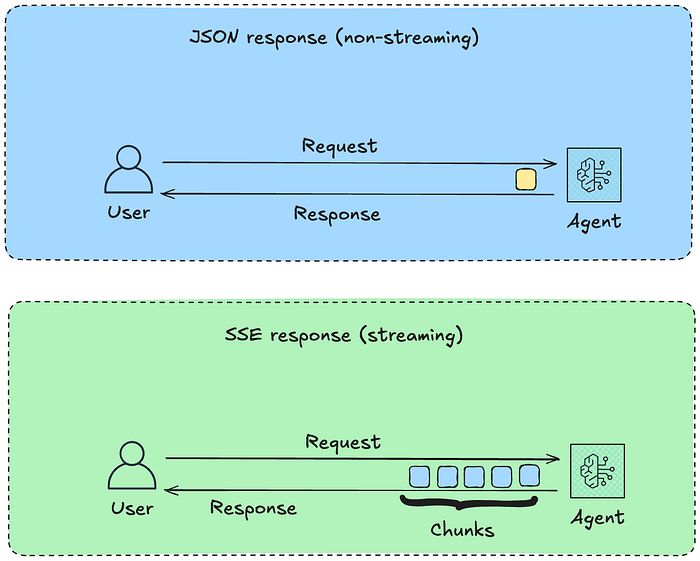

**JSON response (non-streaming):**
ချက်ချင်း ပြီးစီးနိုင်တဲ့ request တွေအတွက် တစ်ခါတည်း အပြီးသတ် response ကို ပြန်ပေးတာ ဖြစ်ပါတယ်ဗျာ။ ဥပမာ - မေးခွန်းတိုတွေ ဖြေတာ၊ တွက်ချက်တာ သို့မဟုတ် status update တွေအတွက် သုံးပါတယ်ဗျ။

```
Content-Type: application/json

{
  "response": "Your agent's response here",
  "status": "success"
}
```

**SSE response (streaming):**
Server-sent events (SSE) ကိုသုံးပြီး real-time တုံ့ပြန်မှုတွေကို ပေးပို့တာ ဖြစ်ပါတယ်ဗျာ။ User experience ကောင်းမွန်စေဖို့ စကားလုံးတွေကို တစ်လုံးချင်း တိုက်ရိုက် stream လုပ်ပြီး ပြသပေးနိုင်ပါတယ်ဗျ။

```
Content-Type: text/event-stream

data: {"event": "partial response 1"}
data: {"event": "partial response 2"}
data: {"event": "final response"}
```

### 2) /ping — GET

Agent အလုပ်လုပ်နေဆဲ ဟုတ်မဟုတ်နဲ့ request လက်ခံဖို့ အဆင်သင့်ဖြစ်မဖြစ် စစ်ဆေးပေးတဲ့ endpoint ဖြစ်ပါတယ်ဗျာ။

* Service monitoring နဲ့ AWS ရဲ့ managed infrastructure ကနေ auto-recovery လုပ်နိုင်ဖို့အတွက် သုံးပါတယ်ဗျ။
* အကယ်၍ agent က background task တွေ run နေရင် `/ping` status ကနေ `HealthyBusy` ဆိုပြီး ပြန်ပေးမှာ ဖြစ်ပါတယ်ဗျာ။ အဲဒီအချိန်မှာတော့ runtime session က active ဖြစ်နေပြီး request အသစ်တွေကို လက်ခံဦးမှာ မဟုတ်ပါဘူးဗျာ။

```json
{
  "status": "<status_value>",
  "time_of_last_update": <unix_timestamp>
}
```

`status` မှာတော့ အောက်ပါ value တွေထဲက တစ်ခု ပြန်ပေးမှာဖြစ်ပါတယ်ဗျာ -
* `Healthy` - အလုပ်သစ်တွေ စတင်လက်ခံဖို့ အသင့်ဖြစ်နေတဲ့ အခြေအနေ
* `HealthyBusy` - စနစ်က အလုပ်လုပ်နေပေမယ့် async tasks တွေနဲ့ အလုပ်ရှုပ်နေတဲ့ အခြေအနေ

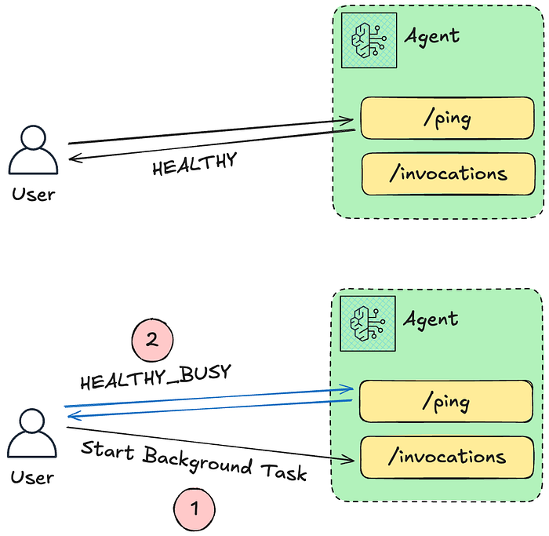

## Deploying an “MCP Server” with Bedrock AgentCore Runtime (Bedrock AgentCore Runtime ပေါ်မှာ “MCP Server” တစ်ခု Deploy လုပ်ခြင်း)

Bedrock AgentCore Runtime က Model Context Protocol (MCP) servers တွေကိုလည်း host လုပ်ပြီး run ပေးနိုင်ပါတယ်ဗျာ။

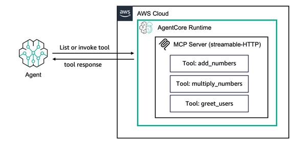

AI Agent လိုပဲ၊ AWS Python SDK က `@mcp.tool` ဆိုတဲ့ lightweight decorator ကို ပံ့ပိုးပေးထားပြီး၊ ဒါကိုသုံးပြီး သင့်ရဲ့ MCP server က သုံးမယ့် tools တွေကို သတ်မှတ်ပေးနိုင်ပါတယ်ဗျာ။ အောက်က code လေးကတော့ MCP Server တစ်ခု ဆောက်ပြထားတာ ဖြစ်ပါတယ် -

```python
from mcp.server.fastmcp import FastMCP
from starlette.responses import JSONResponse

mcp = FastMCP(host="0.0.0.0", stateless_http=True)

@mcp.tool()
def add_numbers(a: int, b: int) -> int:
    """Add two numbers together"""
    return a + b

@mcp.tool()
def multiply_numbers(a: int, b: int) -> int:
    """Multiply two numbers together"""
    return a * b

@mcp.tool()
def greet_user(name: str) -> str:
    """Greet a user by name"""
    return f"Hello, {name}! Nice to meet you."

if __name__ == "__main__":
    mcp.run(transport="streamable-http")
```

MCP ဆိုတာကတော့ AI models တွေကို external data နဲ့ tools တွေဆီ လုံခြုံစွာ ချိတ်ဆက်ပေးတဲ့ protocol တစ်ခုဖြစ်ပါတယ်ဗျာ။ သူ့ရဲ့ အဓိက အယူအဆတွေကတော့ -

* **Tools:** AI ကနေ သွားရောက်ခေါ်ယူ အသုံးပြုနိုင်တဲ့ functions တွေဖြစ်ပါတယ်ဗျ။
* **Streamable HTTP:** AgentCore Runtime က သုံးတဲ့ transport protocol ဖြစ်ပါတယ်ဗျာ။
* **Session Isolation:** Client တစ်ခုချင်းစီကို `Mcp-Session-Id` header သုံးပြီး သီးခြားစီ ခွဲထုတ်ပေးထားပါတယ်ဗျ။
* **Stateless Operation:** Server တွေက scale လုပ်ရလွယ်ကူအောင် stateless ဖြစ်ဖို့ လိုအပ်ပါတယ်ဗျာ။

AgentCore Runtime က MCP servers တွေကို default အနေနဲ့ `0.0.0.0:8000/mcp` path ပေါ်မှာ စောင့်မျှော်နေမှာ ဖြစ်ပါတယ်လေ။

### /mcp — POST

ဝင်လာတဲ့ MCP RPC messages တွေကို လက်ခံပြီး agent ရဲ့ tool capabilities တွေနဲ့ process လုပ်ပေးတာ ဖြစ်ပါတယ်ဗျာ။ `InvokeAgentRuntime` API payload ကနေ လာတဲ့ standard MCP RPC messages တွေကို တိုက်ရိုက် သွားရောက်ချိတ်ဆက်ပေးတာ ဖြစ်ပါတယ်ဗျ။

JSON-RPC စနစ်ကို အခြေခံထားပြီး `application/json` နဲ့ `text/event-stream` response content-types နှစ်မျိုးလုံးကို support ပေးပါတယ်ဗျာ။

ဒီ endpoint ရဲ့ လုပ်ဆောင်ချက်တွေကတော့ -
* Tool invocation နဲ့ management လုပ်ခြင်း
* Agent ရဲ့ စွမ်းဆောင်ရည်တွေကို discovery လုပ်ခြင်း
* Resource တွေကို ဝင်ရောက်အသုံးပြုခြင်း
* Multi-step agent workflows တွေကို လုပ်ဆောင်ပေးခြင်း ဖြစ်ပါတယ်ဗျာ။

## Deploying an “A2A Servers” with Bedrock AgentCore Runtime (Bedrock AgentCore Runtime ပေါ်မှာ “A2A Servers” များ Deploy လုပ်ခြင်း)

Amazon Bedrock AgentCore Runtime ပေါ်မှာ Agent-to-Agent (A2A) servers တွေကိုလည်း deploy လုပ်ပြီး run နိုင်ပါတယ်ဗျာ။

[A2A protocol](https://a2a-protocol.org/dev/specification/) ဆိုတာကတော့ မတူညီတဲ့ သီးခြား AI agent systems တွေအကြား ဆက်သွယ်ပြောဆိုနိုင်ဖို့ တည်ဆောက်ထားတဲ့ open standard တစ်ခု ဖြစ်ပါတယ်ဗျာ။ မတူညီတဲ့ frameworks တွေ၊ languages တွေ သို့မဟုတ် မတူညီတဲ့ vendors တွေဆောက်ထားတဲ့ agents တွေအကြား ဆက်သွယ်ဖို့ ဘုံစကားပြောစနစ် (common language) အဖြစ် အလုပ်လုပ်ပေးတာ ဖြစ်ပါတယ်လေ။

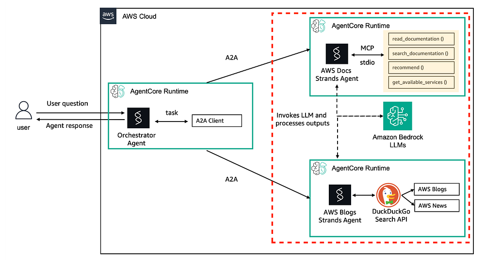

အောက်က code လေးကတော့ A2A server တစ်ခု တည်ဆောက်ပုံ ဖြစ်ပါတယ်ဗျာ -

```python
import logging  
import os  
from strands_tools.calculator import calculator  
from strands import Agent  
from strands.multiagent.a2a import A2AServer  
import uvicorn  
from fastapi import FastAPI  

logging.basicConfig(level=logging.INFO)  

# Use the complete runtime URL from environment variable, fallback to local  
runtime_url = os.environ.get('AGENTCORE_RUNTIME_URL', 'http://127.0.0.1:9000/')  

logging.info(f"Runtime URL: {runtime_url}")  

strands_agent = Agent(  
    name="Calculator Agent",  
    description="A calculator agent that can perform basic arithmetic operations.",  
    tools=[calculator],  
    callback_handler=None  
)  

host, port = "0.0.0.0", 9000  

# Pass runtime_url to http_url parameter AND use serve_at_root=True  
a2a_server = A2AServer(  
    agent=strands_agent,  
    http_url=runtime_url,  
    serve_at_root=True  # Serves locally at root (/) regardless of remote URL path complexity  
)  

app = FastAPI()  

@app.get("/ping")  
def ping():  
    return {"status": "healthy"}  

app.mount("/", a2a_server.to_fastapi_app())  

if __name__ == "__main__":  
    uvicorn.run(app, host=host, port=port)
```

* **Strands Agent:** သီးခြား tools နဲ့ capabilities တွေပါဝင်တဲ့ agent တစ်ခုကို တည်ဆောက်ပေးပါတယ်။
* **A2AServer:** Agent ကို A2A protocol နဲ့ ကိုက်ညီအောင် wrap လုပ်ပေးပါတယ်ဗျာ။
* **Agent Card URL:** `AGENTCORE_RUNTIME_URL` environment variable ကို သုံးပြီး deployment context ပေါ်မူတည်ပြီး မှန်ကန်တဲ့ URL ကို dynamically ဆောက်ပေးပါတယ်။
* **Port 9000:** A2A servers တွေဟာ AgentCore Runtime မှာ default အားဖြင့် port 9000 ပေါ်မှာ run ပါတယ်။

A2A server ကို deploy လုပ်ပြီးရင်တော့ A2A server ရဲ့ identity, capabilities, endpoints နဲ့ authentication specifications တွေကို ဖော်ပြပေးတဲ့ JSON metadata document ဖြစ်တဲ့ **Agent Card** ကို ရယူရမှာ ဖြစ်ပါတယ်ဗျာ။


ဒါကတော့ A2A ecosystem ထဲမှာ အလိုအလျောက် agent discovery လုပ်ဖို့ ကူညီပေးပါတယ်ဗျာ -

```python
import os
import json
import requests
from uuid import uuid4
from urllib.parse import quote

def fetch_agent_card():
    # Get environment variables
    agent_arn = os.environ.get('AGENT_ARN')
    bearer_token = os.environ.get('BEARER_TOKEN')

    if not agent_arn:
        print("Error: AGENT_ARN environment variable not set")
        return

    if not bearer_token:
        print("Error: BEARER_TOKEN environment variable not set")
        return

    # URL encode the agent ARN
    escaped_agent_arn = quote(agent_arn, safe='')

    # Construct the URL
    url = f"https://bedrock-agentcore.us-west-2.amazonaws.com/runtimes/{escaped_agent_arn}/invocations/.well-known/agent-card.json"

    # Generate a unique session ID
    session_id = str(uuid4())
    print(f"Generated session ID: {session_id}")

    # Set headers
    headers = {
        'Accept': '*/*',
        'Authorization': f'Bearer {bearer_token}',
        'X-Amzn-Bedrock-AgentCore-Runtime-Session-Id': session_id
    }

    try:
        # Make the request
        response = requests.get(url, headers=headers)
        response.raise_for_status()

        # Parse and pretty print JSON
        agent_card = response.json()
        print(json.dumps(agent_card, indent=2))

        return agent_card

    except requests.exceptions.RequestException as e:
        print(f"Error fetching agent card: {e}")
        return None

if __name__ == "__main__":
    fetch_agent_card()
```

Agent Card ရဲ့ URL ကို ရပြီဆိုရင်တော့ `AGENTCORE_RUNTIME_URL` ကို environment variable အنهနဲ့ export လုပ်ပေးရပါမယ်ဗျာ -

```bash
export AGENTCORE_RUNTIME_URL="https://bedrock-agentcore.us-west-2.amazonaws.com/runtimes/<ARN>/invocations/"
```

နောက်ဆုံးအဆင့်ကတော့ deploy လုပ်ထားတဲ့ A2A server ကို invoke လုပ်ဖို့ client code ရေးပြီး စမ်းသပ်ကြည့်ဖို့ ဖြစ်ပါတယ်ဗျာ -

```python
import asyncio
import logging
import os
from uuid import uuid4

import httpx
from a2a.client import A2ACardResolver, ClientConfig, ClientFactory
from a2a.types import Message, Part, Role, TextPart

logging.basicConfig(level=logging.INFO)
logger = logging.getLogger(__name__)

DEFAULT_TIMEOUT = 300  # set request timeout to 5 minutes

def create_message(*, role: Role = Role.user, text: str) -> Message:
    return Message(
        kind="message",
        role=role,
        parts=[Part(TextPart(kind="text", text=text))],
        message_id=uuid4().hex,
    )

async def send_sync_message(message: str):
    # Get runtime URL from environment variable
    runtime_url = os.environ.get('AGENTCORE_RUNTIME_URL')
    
    # Generate a unique session ID
    session_id = str(uuid4())
    print(f"Generated session ID: {session_id}")

    # Add authentication headers for Amazon Bedrock AgentCore
    headers = {"Authorization": f"Bearer {os.environ.get('BEARER_TOKEN')}",
        'X-Amzn-Bedrock-AgentCore-Runtime-Session-Id': session_id}
        
    async with httpx.AsyncClient(timeout=DEFAULT_TIMEOUT, headers=headers) as httpx_client:
        # Get agent card from the runtime URL
        resolver = A2ACardResolver(httpx_client=httpx_client, base_url=runtime_url)
        agent_card = await resolver.get_agent_card()

        # Agent card contains the correct URL (same as runtime_url in this case)
        # No manual override needed - this is the path-based mounting pattern

        # Create client using factory
        config = ClientConfig(
            httpx_client=httpx_client,
            streaming=False,  # Use non-streaming mode for sync response
        )
        factory = ClientFactory(config)
        client = factory.create(agent_card)

        # Create and send message
        msg = create_message(text=message)

        # With streaming=False, this will yield exactly one result
        async for event in client.send_message(msg):
            if isinstance(event, Message):
                logger.info(event.model_dump_json(exclude_none=True, indent=2))
                return event
            elif isinstance(event, tuple) and len(event) == 2:
                # (Task, UpdateEvent) tuple
                task, update_event = event
                logger.info(f"Task: {task.model_dump_json(exclude_none=True, indent=2)}")
                if update_event:
                    logger.info(f"Update: {update_event.model_dump_json(exclude_none=True, indent=2)}")
                return task
            else:
                # Fallback for other response types
                logger.info(f"Response: {str(event)}")
                return event

# Usage - Uses AGENTCORE_RUNTIME_URL environment variable
asyncio.run(send_sync_message("what is 101 * 11"))
```

Amazon Bedrock AgentCore ရဲ့ A2A protocol support က proxy layer တစ်ခုအနေနဲ့ အလုပ်လုပ်ပြီး A2A servers တွေနဲ့ ချိတ်ဆက်ပေးတာ ဖြစ်ပါတယ်ဗျာ။ ဒီပတ်ဝန်းကျင်မှာ container တွေဟာ stateless ဖြစ်ပြီး port `9000` (`0.0.0.0:9000/`) ပေါ်မှာ run ရမှာ ဖြစ်ပါတယ်ဗျာ။

## Use isolated sessions for agents (Agent များအတွက် သီးခြားခွဲထုတ်ထားသော Sessions များ သုံးခြင်း)

Amazon Bedrock AgentCore Runtime က user session တစ်ခုချင်းစီကို isolate (သီးခြားခွဲထုတ်) ပေးနိုင်ပြီး၊ session တစ်ခုအတွင်း ဝင်လာမယ့် invocations အများကြီးအတွက် context တွေကို လုံခြုံစွာ ပြန်သုံးနိုင်အောင် လုပ်ဆောင်ပေးပါတယ်ဗျာ။

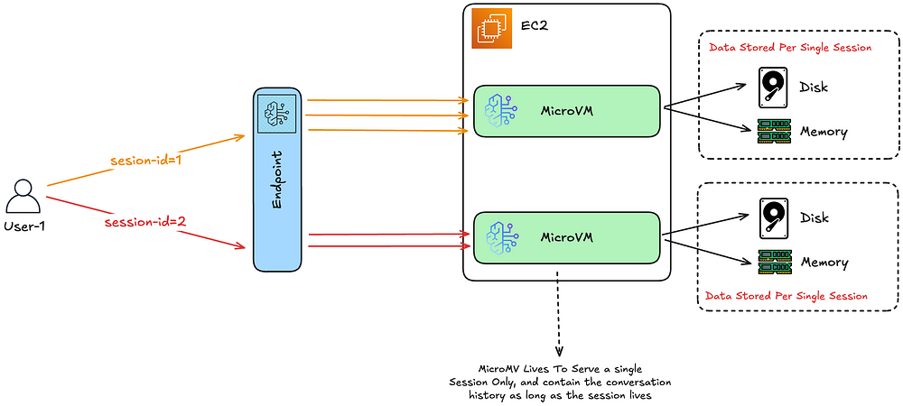

AI agent workloads တွေမှာ session isolation က အောက်ပါအချက်တွေကြောင့် အင်မတန် အရေးကြီးပါတယ်ဗျာ -

* **Complete execution environment separation:** AgentCore Runtime မှာရှိတဲ့ user session တစ်ခုစီက Compute, memory နဲ့ filesystem resources သီးသန့်ပါဝင်တဲ့ MicroVM တစ်ခုစီကို ရရှိကြပါတယ်ဗျာ။ ဒါကြောင့် user တစ်ယောက်ရဲ့ agent က အခြား user တစ်ယောက်ရဲ့ data ကို ဝင်ရောက်ကြည့်ရှုလို့ မရနိုင်ပါဘူး။ Session ပြီးဆုံးသွားရင်တော့ microVM တစ်ခုလုံးကို ဖျက်ဆီးပစ်ပြီး session data အားလုံးကို sanitize လုပ်ပစ်တာမို့လို့ data ယိုစိမ့်မှု အန္တရာယ် မရှိတော့ပါဘူးဗျာ။
* **Stateful reasoning processes:** Stateless functions တွေနဲ့မတူဘဲ AI agents တွေဟာ စကားပြောဆိုမှုတစ်လျှောက် ရှုပ်ထွေးတဲ့ contextual state တွေကို ထိန်းသိမ်းထားဖို့ လိုအပ်ပါတယ်ဗျာ။ AgentCore Runtime က ဒီ state တွေကို လုံခြုံစွာ ထိန်းသိမ်းပေးပြီး user တွေအကြား context မရောထွေးအောင် အာမခံချက် ပေးပါတယ်လေ။
* **Privileged tool operations:** AI agents တွေဟာ user ကိုယ်စား tools တွေကိုသုံးပြီး အရေးကြီးတဲ့ အလုပ်တွေကို လုပ်ဆောင်ပေးကြပါတယ်ဗျာ။ AgentCore Runtime ရဲ့ isolation model က ဒီ tool operations တွေရဲ့ security credentials တွေ သို့မဟုတ် permissions တွေကို session တစ်ခုနဲ့တစ်ခု မရောထွေးအောင် ကာကွယ်ပေးပါတယ်ဗျာ။
* **Deterministic security for non-deterministic processes:** AI agent ရဲ့ အပြုအမူတွေက တစ်ခါတလေ non-deterministic (ခန့်မှန်းရခက်) ဖြစ်တတ်ပါတယ်ဗျ။ ဒါပေမယ့် AgentCore Runtime ကတော့ agent ရဲ့ အပြုအမူ ဘယ်လိုပဲရှိရှိ လုံခြုံရေးစည်းဝိုင်း (isolation boundaries) ကို တိကျသေချာစွာ ထိန်းသိမ်းပေးထားပါတယ်ဗျာ။

### Understanding ephemeral context (ယာယီ Context ကို နားလည်ခြင်း)

AgentCore က session isolation ကို အပြည့်အဝ ပံ့ပိုးပေးပေမယ့် ဒီ sessions တွေက ephemeral (ယာယီ) ဖြစ်ပါတယ်ဗျာ။ ဆိုလိုတာက memory သို့မဟုတ် disk ထဲမှာ ရေးထားသမျှ data တွေက session ရှိနေစဉ်အတွင်းမှာပဲ တည်ရှိနေမှာ ဖြစ်ပါတယ်လေ။


စကားပြောဆိုမှုမှတ်တမ်း (conversation history) သို့မဟုတ် user preferences စတဲ့ data တွေကို session ပြီးဆုံးသည့်တိုင် ဆက်လက်သိမ်းဆည်းထားချင်တယ်ဆိုရင်တော့ **"AgentCore Memory"** ကို သုံးရမှာ ဖြစ်ပါတယ်ဗျာ။ ဒီ service က short-term နဲ့ long-term memory capabilities နှစ်ခုလုံးကို ပံ့ပိုးပေးထားတဲ့ persistent storage ဖြစ်ပါတယ်လေ။

Session တွေမှာ အောက်ပါ အခြေအနေ ၃ မျိုး ရှိနိုင်ပါတယ်ဗျ -
* **Active:** Sync request တစ်ခုကို ဆောင်ရွက်နေတာဖြစ်စေ သို့မဟုတ် background task တွေကို လုပ်ဆောင်နေတာ ဖြစ်စေ ဖြစ်ပါတယ်ဗျ။ Background task ရှိနေရင် agent က "HealthyBusy" status နဲ့ ping ပြန်ပေးမှာ ဖြစ်ပါတယ်ဗျာ။
* **Idle:** ဘာ request မှ လုပ်ဆောင်မနေဘဲ နောက်ထပ် invoke လုပ်လာမယ့်အချိန်ကို စောင့်ဆိုင်းနေတဲ့ အခြေအနေ ဖြစ်ပါတယ်ဗျ။
* **Terminated:** Session ရဲ့ microVM ပတ်ဝန်းကျင်ကို ပိတ်သိမ်းလိုက်တဲ့ အခြေအနေ ဖြစ်ပါတယ်ဗျာ။ Idle အခြေအနေမှာ မိနစ် ၁၅ မိနစ်ကြာတာဖြစ်စေ၊ အမြင့်ဆုံး run ချိန် ၈ နာရီပြည့်သွားတာဖြစ်စေ၊ သို့မဟုတ် စနစ်က unhealthy ဖြစ်သွားရင် ဖြစ်စေ session ကို terminate လုပ်ပါတယ်ဗျာ။ Session ပိတ်သွားပြီးမှ runtimeSessionId အဟောင်းနဲ့ ထပ်မံခေါ်ယူရင် microVM အသစ်တစ်ခု ပြန်လည်တည်ဆောက်သွားမှာ ဖြစ်ပါတယ်လေ။

### How to use sessions (Sessions တွေကို အသုံးပြုပုံ)

Session တွေကို ထိရောက်စွာ အသုံးပြုဖို့အတွက် -
* User တစ်ဦးစီ သို့မဟုတ် conversation တစ်ခုစီအတွက် အနည်းဆုံး ၃၃ လုံး ပါဝင်တဲ့ unique session ID ကို generate လုပ်ပါဗျ။
* ဆက်စပ်နေတဲ့ invocations အားလုံးအတွက် တူညီတဲ့ session ID ကို သုံးပေးပါဗျာ။
* User မတူရင် သို့မဟုတ် စကားပြောခန်း မတူရင် မတူညီတဲ့ session IDs တွေကို သုံးပါဗျာ။

စကားပြောဆိုမှုတစ်ခုမှာ sessions သုံးတဲ့ ဥပမာလေးပါဗျာ -

```python
# First message in a conversation
response1 = agent_core_client.InvokeAgentRuntime(
   agentRuntimeArn=agent_arn,
   runtimeSessionId="user-123456-conversation-12345678",
   payload=json.dumps({"prompt": "Tell me about AWS"}).encode()
)

# Follow-up message in the same conversation reuses the runtimeSessionId.
response2 = agent_core_client.InvokeAgentRuntime(
   agentRuntimeArn=agent_arn,
   runtimeSessionId="user-123456-conversation-12345678",
   payload=json.dumps({"prompt": "How does it compare to other cloud providers"}).encode()
)
```

ဒီလို တူညီတဲ့ `runtimeSessionId` ကို သုံးခြင်းအားဖြင့် agent အနေနဲ့ ပြီးခဲ့တဲ့ အပြန်အလှန် စကားပြောဆိုမှုတွေကို မှတ်မိနေပြီး ပိုပြီး ဆက်စပ်မှုရှိတဲ့ တုံ့ပြန်မှုတွေကို ပေးနိုင်မှာ ဖြစ်ပါတယ်ဗျာ။

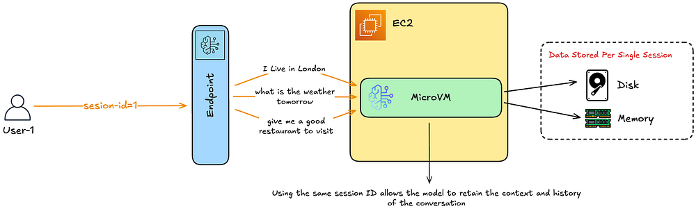

### Stop a running session (လည်ပတ်နေသော Session အား ရပ်တန့်ခြင်း)

`StopRuntimeSession` operation ကို သုံးပြီး runtime resources တွေကို သန့်ရှင်းရေးလုပ်ဖို့အတွက် active ဖြစ်နေတဲ့ session တွေကို ချက်ချင်း ပိတ်သိမ်းနိုင်ပါတယ်ဗျာ။

ဒီ operation က သတ်မှတ်ထားတဲ့ session ကို ချက်ချင်း ပိတ်ပေးပြီး streaming တုံ့ပြန်မှုတွေကိုလည်း ရပ်တန့်ပေးသွားမှာဖြစ်လို့ orphaned ဖြစ်ကျန်နေခဲ့တဲ့ session တွေ မရှိအောင် release လုပ်ပေးနိုင်ပါတယ်လေ။

`StopRuntimeSession` ကို အောက်ပါ scenario တွေမှာ သုံးသင့်ပါတယ်ဗျာ -
* **User-initiated end:** User က စကားပြောခန်းကို နှုတ်ဆက်ပြီး ပိတ်လိုက်တဲ့အခါ
* **Application shutdown:** Application မပိတ်ခင် အလိုအလျောက် သန့်ရှင်းရေးလုပ်ချင်တဲ့အခါ
* **Error handling:** တုံ့ပြန်မှု မရှိတော့တဲ့ သို့မဟုတ် stalled ဖြစ်နေတဲ့ session တွေကို force ပိတ်ချင်တဲ့အခါ
* **Quota management:** မသုံးတော့တဲ့ session တွေကို ပိတ်ပြီး limits တွေမကျော်အောင် စီမံချင်တဲ့အခါ
* **Timeout handling:** သတ်မှတ်ချိန်ထက် ကျော်လွန်နေတဲ့ session တွေကို ပိတ်ချင်တဲ့အခါ

```python
import boto3

# Initialize the AgentCore client
client = boto3.client('bedrock-agentcore', region_name='us-west-2')

try:
    # Stop the runtime session
    response = client.stop_runtime_session(
        agentRuntimeArn='arn:aws:bedrock-agentcore:us-west-2:123456789012:runtime/my-agent',
        runtimeSessionId='your-session-id',
        qualifier='DEFAULT'  # Optional: endpoint name
    )

    print(f"Session terminated successfully")
    print(f"Request ID: {response['ResponseMetadata']['RequestId']}")

except client.exceptions.ResourceNotFoundException:
    print("Session not found or already terminated")
except client.exceptions.AccessDeniedException:
    print("Insufficient permissions to stop session")
except Exception as e:
    print(f"Error stopping session: {str(e)}")
```

> Active session တစ်ခုကို ရပ်တန့်လိုက်ခြင်းက နောက်ကွယ်က microVM ကို ရပ်တန့်ပေးသွားမှာမို့လို့ resources တွေ သက်သာစေမှာ ဖြစ်ပါတယ်ဗျာ။

## Handle asynchronous and long-running agents with Amazon Bedrock AgentCore Runtime (Asynchronous နှင့် အချိန်ကြာမြင့်မည့် Agents များကို စီမံခန့်ခွဲခြင်း)

Amazon Bedrock AgentCore Runtime ဟာ asynchronous processing နဲ့ ရေရှည်အလုပ်လုပ်ရမယ့် (long-running) agents တွေကိုလည်း ကောင်းမွန်စွာ စီမံပေးနိုင်ပါတယ်ဗျာ။ Asynchronous tasks တွေကြောင့် agent အနေနဲ့ user ကို "အလုပ်စလုပ်နေပြီနော်" လို့ ချက်ချင်းတုံ့ပြန်ပြီး နောက်ကွယ်မှာ အလုပ်တွေကို ဆက်လုပ်နေနိုင်ပါတယ်ဗျ။

ဒီစနစ်ကြောင့် agent အနေနဲ့ -
* မိနစ် သို့မဟုတ် နာရီချီ ကြာမြင့်မယ့် task တစ်ခုကို စတင်လုပ်ဆောင်နိုင်ခြင်း
* Client ကို "ဒီအလုပ်ကို စလုပ်နေပါပြီဗျာ" လို့ ချက်ချင်း response ပြန်နိုင်ခြင်း
* နောက်ကွယ် (background) မှာ အလုပ်ကို ဆက်လက်လုပ်ဆောင်နေခြင်း
* User အနေနဲ့ နောက်မှပြန်လာပြီး result ကို စစ်ဆေးနိုင်ခြင်း စတာတွေကို လုပ်ဆောင်နိုင်မှာ ဖြစ်ပါတယ်ဗျာ။

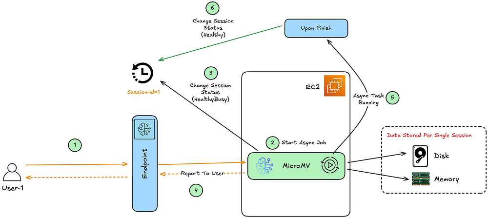

### Asynchronous processing model (Asynchronous လုပ်ဆောင်မှုပုံစံ)

Amazon Bedrock AgentCore SDK ဟာ synchronous နဲ့ asynchronous processing နှစ်ခုလုံးကို API တစ်ခုတည်းကနေ support ပေးထားတာ ဖြစ်ပါတယ်ဗျာ။ ဒါက client နဲ့ agent developers တွေအတွက် အင်မတန် အဆင်ပြေစေတဲ့ design pattern တစ်ခုပဲ ဖြစ်ပါတယ်လေ။

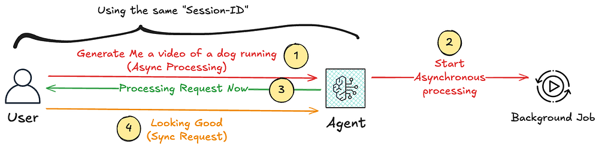

Client အနေနဲ့ synchronous လား asynchronous လားဆိုတာ ခွဲခြားလုပ်ဆောင်နေစရာမလိုဘဲ တူညီတဲ့ API ကို သုံးနိုင်ပါတယ်ဗျာ။ ပြီးတော့ တူညီတဲ့ session ID ကို ပြန်သုံးနိုင်တာမို့လို့ ရှုပ်ထွေးတဲ့ task management logic တွေ ရေးစရာမလိုဘဲ context တွေကို အလွယ်တကူ ပြန်သုံးနိုင်မှာ ဖြစ်ပါတယ်ဗျ။

### Runtime session lifecycle management (Session Lifecycle စီမံခန့်ခွဲမှု)

Agent က သူ့ရဲ့ အခြေအနေကို `/ping` health status ကနေတစ်ဆင့် အသိပေးပါတယ်ဗျ။ `HealthyBusy` ကတော့ agent က background task တွေနဲ့ အလုပ်ရှုပ်နေတယ်လို့ အသိပေးတာဖြစ်ပြီး၊ `Healthy` ကတော့ idle (အလုပ်အသစ် လက်ခံဖို့အသင့်) ဖြစ်နေတာကို ဆိုလိုပါတယ်ဗျာ။ Idle ဖြစ်နေပြီး ၁၅ မိနစ်ကြာရင် session ကို auto terminate လုပ်သွားမှာ ဖြစ်ပါတယ်ဗျ။

> Session status က `HealthyBusy` ဖြစ်နေစဉ်အတွင်းမှာတော့ runtime ဟာ ဒီ session အတွက် request အသစ် သို့မဟုတ် entrypoint invocations အသစ်တွေကို လက်ခံမှာ မဟုတ်ပါဘူးဗျာ။

### Asynchronous task decorator (Asynchronous Task များကို သတ်မှတ်ပေးသည့် Decorator)

Amazon Bedrock AgentCore SDK က `@app.async_task` decorator ကို သုံးပြီး asynchronous functions တွေကို လွယ်ကူစွာ သတ်မှတ် ခြေရာခံနိုင်အောင် ကူညီပေးပါတယ်ဗျာ။

```python
# Automatically track asynchronous functions:
@app.async_task
async def background_work():
    await asyncio.sleep(10)  # Status becomes "HealthyBusy"
    return "done"

@app.entrypoint
async def handler(event):
    asyncio.create_task(background_work())
    return {"status": "started"}
```

လုပ်ဆောင်ပုံကတော့ ရိုးရှင်းပါတယ်ဗျာ -
* `@app.async_task` decorator က function ရဲ့ run ချိန်ကို ခြေရာခံပေးပါတယ်။
* Function စ run တဲ့အခါ /ping status က `HealthyBusy` ကို ပြောင်းသွားပါတယ်။
* Function အလုပ်ပြီးသွားတဲ့အခါ status က `Healthy` ကို ပြန်လည်ရောက်ရှိသွားပါတယ်ဗျာ။

## AgentCore Runtime LifeCycle Events (Runtime ၏ သက်တမ်းတစ်လျှောက် ဖြစ်ရပ်များ)

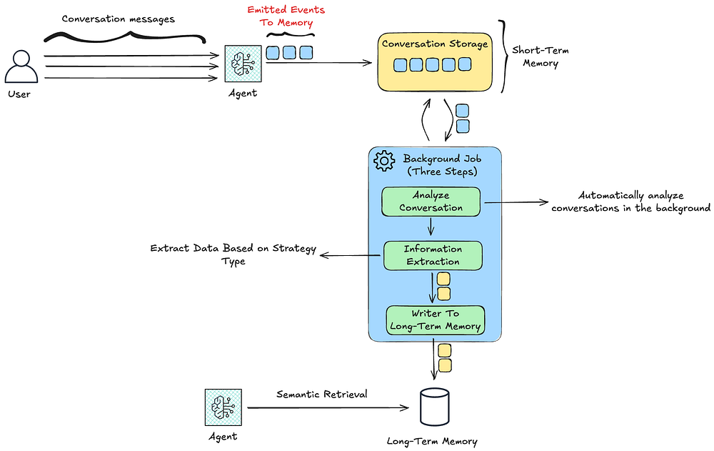

AgentCore Runtime Lifecycle Events တွေဟာ agent တစ်ခု လည်ပတ်နေတဲ့ အဆင့်ဆင့်မှာ အလိုအလျောက် logic တွေ (ဥပမာ- memory load တာ၊ logs ရေးတာ) ကို သတ်မှတ်ထားတဲ့အဆင့်တွေမှာ run ပေးနိုင်ဖို့ ကူညီပေးတဲ့ hooks တွေ ဖြစ်ပါတယ်ဗျာ။

## AgentCore Runtime versioning and endpoints (Runtime Version စီမံခြင်းနှင့် Endpoints များ)

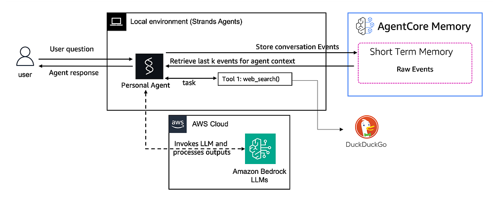

AgentCore Runtime က endpoint aliases တွေနဲ့ versioning ကို support လုပ်ပေးထားတာမို့လို့ production application တွေကို မထိခိုက်စေဘဲ agent updates တွေကို လုံခြုံစိတ်ချစွာ လုပ်ဆောင်နိုင်မှာ ဖြစ်ပါတယ်ဗျာ။

## Amazon Bedrock AgentCore Memory: Add memory to your Agent (Agent များအတွက် မှတ်ဉာဏ် ထည့်သွင်းပေးခြင်း)

Amazon Bedrock AgentCore Memory ဆိုတာကတော့ သင့်ရဲ့ AI agents တွေကို စကားပြောဆိုမှုမှတ်တမ်းတွေ သို့မဟုတ် အရေးကြီးတဲ့ အချက်အလက်တွေကို မှတ်မိစေနိုင်တဲ့ service တစ်ခု ဖြစ်ပါတယ်ဗျာ။

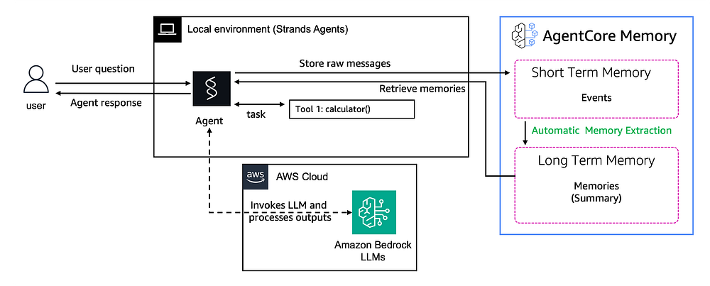

## Memory types (မှတ်ဉာဏ် အမျိုးအစားများ)

အဓိကအားဖြင့် memory အမျိုးအစား နှစ်ခု ရှိပါတယ်ဗျာ -

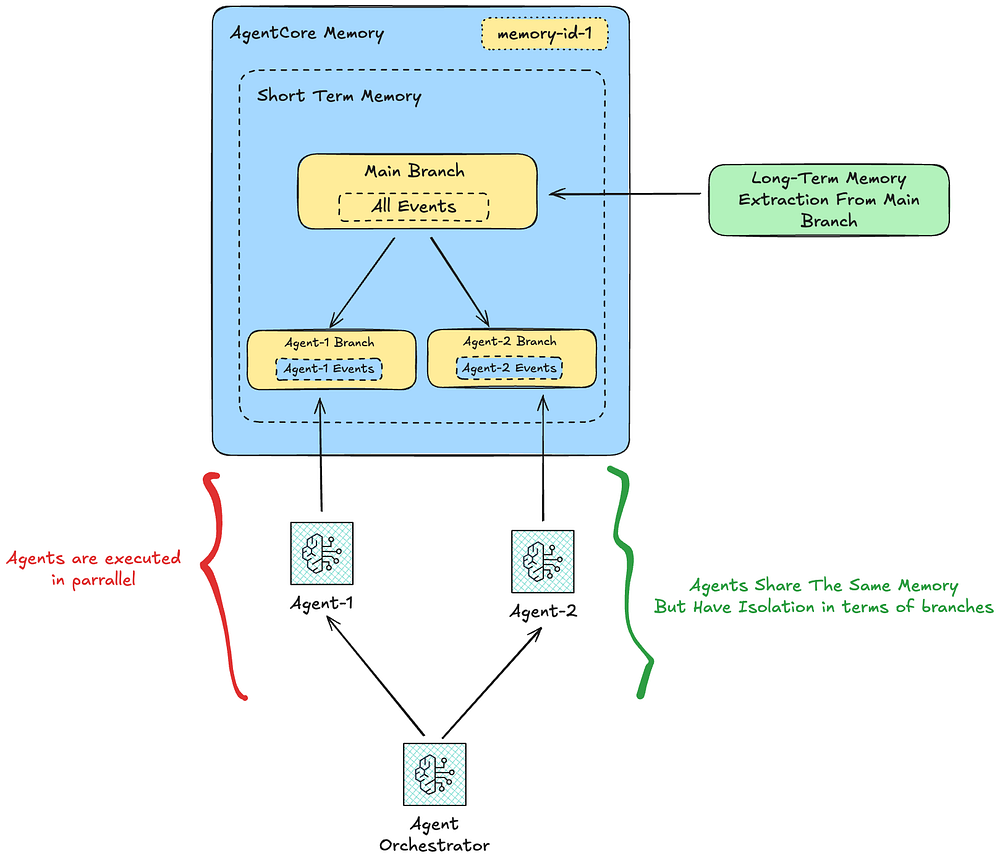

### 1) Short-term memory (ရေတိုမှတ်ဉာဏ်)

လက်ရှိပြောဆိုနေတဲ့ session တစ်ခုအတွင်းမှာပဲ အသုံးပြုတဲ့ ယာယီမှတ်ဉာဏ် ဖြစ်ပါတယ်ဗျာ။ ဥပမာ - လတ်တလော ပြောခဲ့တဲ့ စကား ၅ ကြိမ် သို့မဟုတ် ၁၀ ကြိမ်ရဲ့ သမိုင်းကြောင်းကို မှတ်မိနေစေတာမျိုး ဖြစ်ပါတယ်ဗျ။

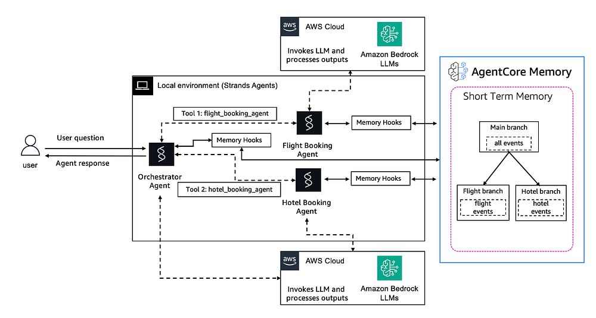

### 2) Long-term memory (ရေရှည်မှတ်ဉာဏ်)

Session တွေ အများကြီး ပြီးဆုံးသွားသည့်တိုင်အောင် user ရဲ့ စရိုက်၊ စိတ်ဝင်စားမှု၊ ယခင်က ပြောခဲ့ဖူးတဲ့ အရေးကြီးတဲ့ အဖြစ်အပျက်တွေ (facts) ကို အမြဲတမ်း မှတ်မိနေစေမယ့် မှတ်ဉာဏ်မျိုး ဖြစ်ပါတယ်ဗျာ။

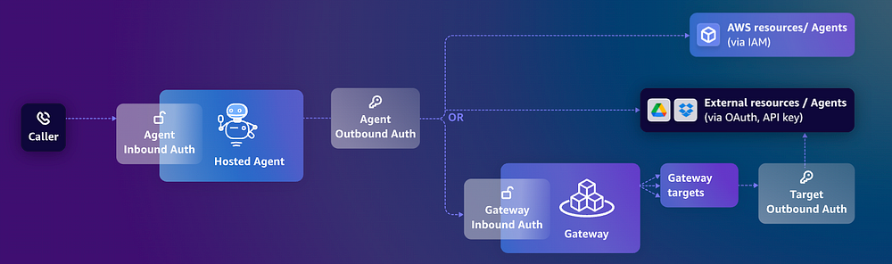

### Memory terminology (မှတ်ဉာဏ်ဆိုင်ရာ အသုံးအနှုန်းများ)

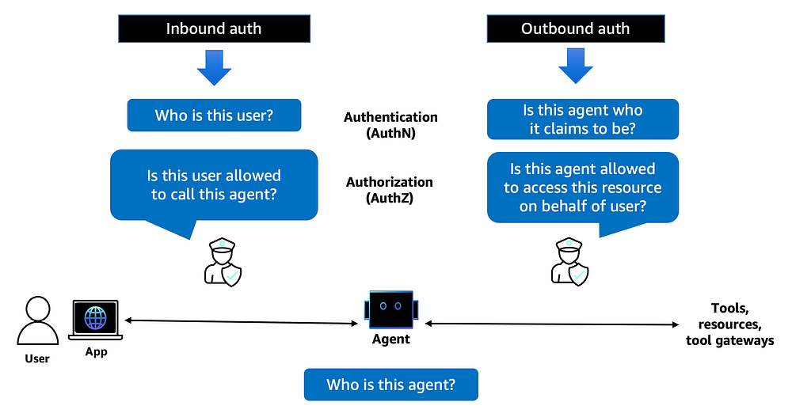

* **Memory Resource:** AgentCore Memory မှာ memory အချက်အလက်တွေ သိမ်းဆည်းဖို့ တည်ဆောက်ထားတဲ့ ဘုံ resource နေရာတစ်ခုဖြစ်ပါတယ်ဗျ။
* **Actor ID:** စကားပြောနေတဲ့ user ကို ခွဲခြားသတ်မှတ်ပေးတဲ့ ID ဖြစ်ပါတယ်ဗျာ။
* **Session ID:** လက်ရှိပြောနေတဲ့ စကားပြောခန်း ID ဖြစ်ပါတယ်ဗျာ။
* **Namespace:** Memory ထဲမှာ အချက်အလက်တွေကို အုပ်စုဖွဲ့ သတ်သတ်မှတ်မှတ် သိမ်းဆည်းဖို့ သုံးတဲ့ path လမ်းကြောင်း ဖြစ်ပါတယ်ဗျ။

### Memory Architecture (မှတ်ဉာဏ်၏ တည်ဆောက်ပုံစနစ်)

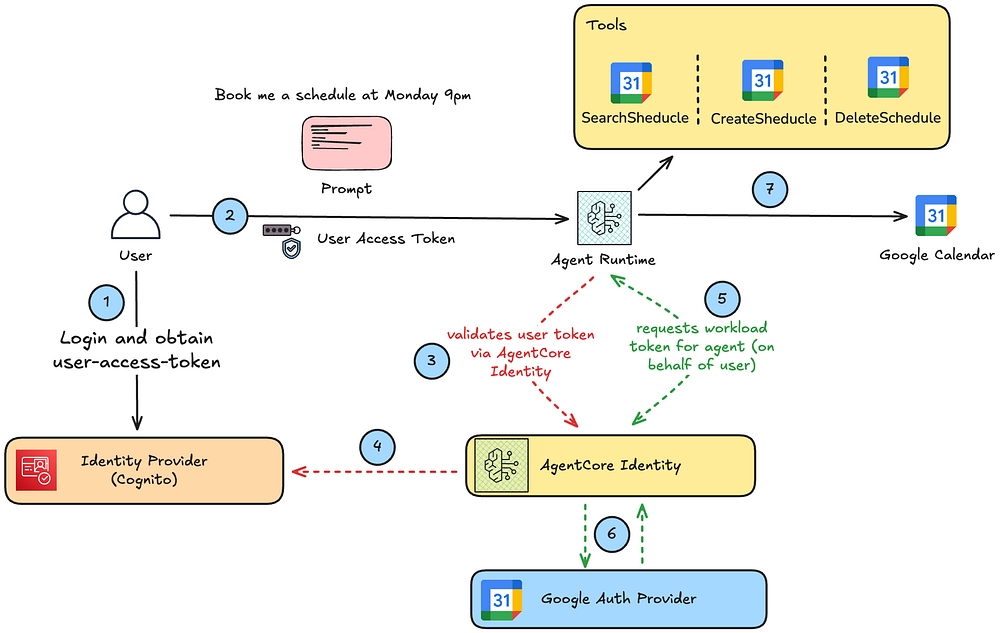

1. **Conversation Interaction:** User က agent နဲ့ စကားပြောပါတယ်။
2. **Background Processing:** သတ်မှတ်ထားတဲ့ strategies တွေက စကားပြောမှတ်တမ်းကို နောက်ကွယ်မှာ အလိုအလျောက် သုံးသပ်ပါတယ်။
3. **Information Extraction:** အရေးကြီးတဲ့ အချက်အလက်တွေကို (ပုံမှန်အားဖြင့် ၁ မိနစ်ခန့်အတွင်းမှာ) ဆွဲထုတ်ယူပါတယ်။
4. **Organized Storage:** ရရှိလာတဲ့ memory တွေကို namespaces တွေအလိုက် သပ်သပ်ရပ်ရပ် သိမ်းဆည်းပါတယ်။
5. **Semantic Retrieval:** User က နောက်တစ်ကြိမ် မေးလာတဲ့အခါ vector similarity ကိုသုံးပြီး ဆက်စပ်မှတ်ဉာဏ်တွေကို ပြန်လည်ထုတ်ယူပေးပါတယ်ဗျာ။
## Memory strategies (မှတ်ဉာဏ် စီမံခန့်ခွဲမှု မဟာဗျူဟာများ)

AgentCore Memory မှာ memory resource တွေဆီ memory strategies တွေ သတ်မှတ်ပေးနိုင်ပါတယ်ဗျာ။ ဒီ strategies တွေက စကားပြောခန်းတွေထဲကနေ ဘယ်လိုအချက်အလက်မျိုးကို ဆွဲထုတ်သိမ်းဆည်းမလဲဆိုတာ ဆုံးဖြတ်ပေးတာ ဖြစ်ပါတယ်လေ။

Strategies တွေကို enable လုပ်ထားရင် conversation events တွေကနေ long-term memories တွေကို အလိုအလျောက် ဆွဲထုတ်သိမ်းဆည်းပေးသွားမှာ ဖြစ်ပါတယ်ဗျာ။

> ကယ်လို့ strategies မသတ်မှတ်ထားဘူးဆိုရင်တော့ long-term memory records တွေကို စနစ်က ဆွဲထုတ်သိမ်းဆည်းပေးမှာ မဟုတ်ပါဘူးဗျာ။

## Built-in strategies (ပါရှိပြီးသား မဟာဗျူဟာများ)

AgentCore Memory မှာ အောက်ပါ built-in memory strategies တွေ သုံးနိုင်ပါတယ်ဗျ -

* **Semantic Memory:** စာဖတ်သူရဲ့ အချက်အလက်အမှန်တွေ (facts) ကို vector embeddings သုံးပြီး similarity search အတွက် သိမ်းဆည်းပေးပါတယ်။
* **Summary Memory:** စကားပြောခန်းရဲ့ အကျဉ်းချုပ် (summary) တွေကို ရေးပြီး သိမ်းပေးပါတယ်။
* **User Preference Memory:** User ရဲ့ ကြိုက်နှစ်သက်မှု (preferences) နဲ့ settings တွေကို မှတ်သားပေးပါတယ်။
* **Custom Memory:** ကိုယ်ပိုင် extraction နဲ့ consolidation logic တွေ ရေးသားနိုင်အောင် လုပ်ဆောင်ပေးပါတယ်ဗျာ။

### 1) Semantic memory strategy

`SemanticMemoryStrategy` ဟာ စကားပြောဆိုမှုတွေထဲကနေ အချက်အလက်အမှန်တွေ (factual information) နဲ့ contextual knowledge တွေကို ရှာဖွေဖော်ထုတ်သိမ်းဆည်းပေးဖို့ ဒီဇိုင်းထုတ်ထားတာ ဖြစ်ပါတယ်ဗျာ။

ဥပမာအားဖြင့် -
* Order number (`#XYZ-123`) က သတ်မှတ်ထားတဲ့ support case နဲ့ သက်ဆိုင်ကြောင်း
* Project ရဲ့ deadline က October 25th ဖြစ်ကြောင်း
* User က software version 2.1 ကို သုံးနေကြောင်း

ဒီလို သိမ်းဆည်းထားတဲ့ အချက်အလက်တွေကို သုံးပြီး agent က ပိုမိုမှန်ကန်ပြီး context-aware ဖြစ်တဲ့ တုံ့ပြန်မှုတွေကို ပေးနိုင်မှာဖြစ်သလို၊ user ကိုလည်း အချက်အလက်တွေ ခဏခဏ ပြန်မေးနေစရာ မလိုတော့ပါဘူးဗျာ။

**Default namespace:** `/strategies/{memoryStrategyId}/actors/{actorId}`

### 2) User preference memory strategy

`UserPreferenceMemoryStrategy` ဟာ user ရဲ့ ရွေးချယ်မှု၊ စရိုက်နဲ့ styles တွေကို စကားပြောခန်းတွေကနေ အလိုအလျောက် ရှာဖွေမှတ်သားပေးတာ ဖြစ်ပါတယ်ဗျာ။

ဥပမာ -
* Customer ရဲ့ ကြိုက်နှစ်သက်တဲ့ shipping carrier သို့မဟုတ် brand
* Developer ရဲ့ ကြိုက်နှစ်သက်တဲ့ coding style သို့မဟုတ် programming language
* User ရဲ့ ပြောဆိုဆက်သွယ်မှု ပုံစံ (ဥပမာ - formal သို့မဟုတ် informal ဖြစ်တဲ့ လေသံ)

ဒီ strategy ကို သုံးခြင်းအားဖြင့် သင့်ရဲ့ agent က user တစ်ဦးစီအတွက် ပိုမိုသင့်တော်တဲ့ recommendations တွေပေးတာ၊ စကားပြောဆိုမှုပုံစံကို လိုက်လျောညီထွေဖြစ်အောင် ပြောင်းလဲပေးတာတွေ လုပ်ဆောင်နိုင်လို့ user experience ကို ပိုမိုကောင်းမွန်စေမှာ ဖြစ်ပါတယ်ဗျာ။

**Default namespace:** `/strategies/{memoryStrategyId}/actors/{actorId}`

### 3) Summary strategy

`SummaryStrategy` ကတော့ session တစ်ခုတည်းမှာရှိတဲ့ စကားပြောဆိုမှုတွေကို အကျဉ်းချုပ် (real-time summaries) ရေးပေးဖို့ တာဝန်ယူပါတယ်ဗျာ။ အဓိကပြောခဲ့တဲ့ ခေါင်းစဉ်တွေ၊ ဆုံးဖြတ်ချက်တွေနဲ့ task တွေကို မှတ်သားပေးတာ ဖြစ်ပါတယ်လေ။

Session တစ်ခုမှာ summary chunks တွေအများကြီး ရှိနိုင်ပြီး ၎င်းတို့ကို ပေါင်းလိုက်ရင် conversation တစ်ခုလုံးရဲ့ summary ကို ရရှိစေမှာ ဖြစ်ပါတယ်ဗျ။

## Get Joud W. Awad’s stories in your inbox (စာရေးသူထံမှ သတင်းအချက်အလက်များ တိုက်ရိုက်ရယူရန်)

Medium မှာ free join ပြီး စာရေးသူဆီက updates တွေကို အီးမေးလ်ထဲ တိုက်ရိုက်ရယူနိုင်ပါတယ်ဗျာ။

ဒီ summary chunks တွေကို namespace filter သုံးပြီး `[ListMemoryRecords]` operation ကနေဖြစ်စေ၊ သို့မဟုတ် `[RetrieveMemoryRecords]` operation ကနေ vector search သုံးပြီး သက်ဆိုင်တဲ့ summary chunks တွေကိုပဲ သီးသန့်ဆွဲထုတ်ပြီးဖြစ်စေ သုံးနိုင်ပါတယ်ဗျာ။

ဥပမာအားဖြင့် -
* Support interaction အကျဉ်းချုပ် - "User က order `#XYZ-123` မှာ ပြဿနာရှိကြောင်း တိုင်ကြားလာလို့ agent က replacement အသစ်တစ်ခု စီစဉ်ပေးလိုက်ပါတယ်။"
* Meeting outcome အကျဉ်းချုပ် - "အဖွဲ့သားတွေက project deadline ကို သောကြာနေ့သို့ ရွှေ့ဆိုင်းရန် သဘောတူညီခဲ့ကြသည်။"

ဒီ summary တွေကို သုံးခြင်းအားဖြင့် agent အနေနဲ့ ရှည်လျားရှုပ်ထွေးတဲ့ စကားပြောမှတ်တမ်းကြီးတစ်ခုလုံးကို ပြန်ဖတ်စရာမလိုဘဲ context ကို ချက်ချင်းပြန်ခေါ်နိုင်လို့ LLM ရဲ့ context window ကို ပိုမိုချွေတာနိုင်မှာ ဖြစ်ပါတယ်ဗျာ။

**Default namespace:** `/strategies/{memoryStrategyId}/actors/{actorId}/sessions/{sessionId}`

## AgentCore Memory Integration (AgentCore Memory ကို ချိတ်ဆက်အသုံးပြုခြင်း)

ဒီအဆင့်မှာတော့ AgentCore `Memory Short-Term` ဘယ်လိုအလုပ်လုပ်သလဲဆိုတာကို အောက်က architecture ပုံလေးကို ကြည့်ပြီး လေ့လာကြည့်ရအောင်ဗျာ -

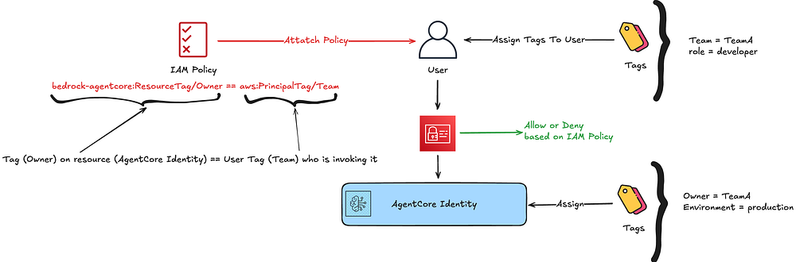

Short-term memory ထဲကို conversation events တွေ အလိုအလျောက် သွားသိမ်းပေးဖို့အတွက် ကျွန်တော်တို့ **"Memory Hook"** ကို ဆောက်ရမှာ ဖြစ်ပါတယ်ဗျာ။ ဒီ hooks တွေက agent ရဲ့ execution lifecycle points တွေမှာ အလိုအလျောက် run ပေးမယ့် special functions တွေဖြစ်ပြီး အဓိက အလုပ်နှစ်ခု လုပ်ဆောင်ပေးပါတယ် -

1. **To load recent conversation:** Agent စတင်တည်ဆောက်တဲ့အချိန် (`AgentInitializedEvent` hook) မှာ လတ်တလော ပြောခဲ့တဲ့ conversation သမိုင်းကြောင်းကို အလိုအလျောက် load လုပ်ပေးပါတယ်။
2. **To store the last message:** စကားပြောပြီးတိုင်း နောက်ဆုံး message အသစ်ကို memory ထဲ အလိုအလျောက် သွားသိမ်းပေးပါတယ်။

ဒီစနစ်ကြောင့် manual လုပ်စရာမလိုဘဲ memory စနစ်ကို အဆင်ပြေပြေ သုံးနိုင်သွားတာ ဖြစ်ပါတယ်ဗျာ။

```python
class MemoryHookProvider(HookProvider):
    def __init__(self, memory_client: MemoryClient, memory_id: str):
        self.memory_client = memory_client
        self.memory_id = memory_id
    
    def on_agent_initialized(self, event: AgentInitializedEvent):
        """Load recent conversation history when agent starts"""
        try:
            # Get session info from agent state
            actor_id = event.agent.state.get("actor_id")
            session_id = event.agent.state.get("session_id")
            
            if not actor_id or not session_id:
                logger.warning("Missing actor_id or session_id in agent state")
                return
            
            # Load the last 5 conversation turns from memory
            recent_turns = self.memory_client.get_last_k_turns(
                memory_id=self.memory_id,
                actor_id=actor_id,
                session_id=session_id,
                k=5
            )
            
            if recent_turns:
                # Format conversation history for context
                context_messages = []
                for turn in recent_turns:
                    for message in turn:
                        role = message['role']
                        content = message['content']['text']
                        context_messages.append(f"{role}: {content}")
                
                context = "\n".join(context_messages)
                # Add context to agent's system prompt.
                event.agent.system_prompt += f"\n\nRecent conversation:\n{context}"
                logger.info(f"✅ Loaded {len(recent_turns)} conversation turns")
                
        except Exception as e:
            logger.error(f"Memory load error: {e}")
    
    def on_message_added(self, event: MessageAddedEvent):
        """Store messages in memory"""
        messages = event.agent.messages
        try:
            # Get session info from agent state
            actor_id = event.agent.state.get("actor_id")
            session_id = event.agent.state.get("session_id")

            if messages[-1]["content"][0].get("text"):
                self.memory_client.create_event(
                    memory_id=self.memory_id,
                    actor_id=actor_id,
                    session_id=session_id,
                    messages=[(messages[-1]["content"][0]["text"], messages[-1]["role"])]
                )
        except Exception as e:
            logger.error(f"Memory save error: {e}")
    
    def register_hooks(self, registry: HookRegistry):
        # Register memory hooks
        registry.add_callback(MessageAddedEvent, self.on_message_added)
        registry.add_callback(AgentInitializedEvent, self.on_agent_initialized)
```

ပြီးရင်တော့ အောက်ပါအတိုင်း agent ဆောက်တဲ့အခါ `MemoryHook` ကို တွဲပေးလိုက်ရုံပါပဲဗျာ -

```python
def create_personal_agent():
    """Create personal agent with memory and web search"""
    agent = Agent(
        name="PersonalAssistant",
        model="us.anthropic.claude-3-7-sonnet-20250219-v1:0",  # or your preferred model
        system_prompt=f"""You are a helpful personal assistant with web search capabilities.
        
        You can help with:
        - General questions and information lookup
        - Web searches for current information
        - Personal task management
        
        When you need current information, use the websearch function.
        Today's date: {datetime.today().strftime('%Y-%m-%d')}
        Be friendly and professional.""",
        hooks=[MemoryHookProvider(client, memory_id)],
        tools=[websearch],
        state={"actor_id": ACTOR_ID, "session_id": SESSION_ID}
    )
    return agent

# Create agent
agent = create_personal_agent()
logger.info("✅ Personal agent created with memory and web search")
```

Short-term memory ကို နားလည်ပြီးရင်တော့၊ Long-term memory ဘယ်လိုအလုပ်လုပ်သလဲဆိုတာ ဆက်ကြည့်ရအောင်ဗျာ။ အောက်ကပုံလေးက memory ထဲကို strategies တွေ ထည့်သွင်းပုံ ဖြစ်ပါတယ် -

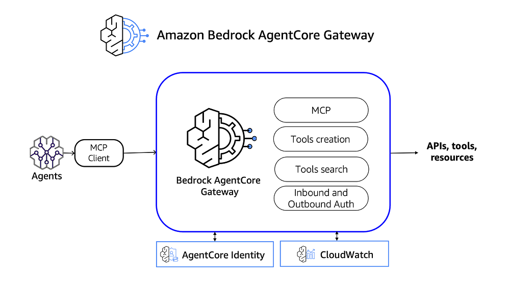

ပထမဆုံးအနေနဲ့ memory resource ထဲကို memory strategies တွေ ထည့်သွင်းပါမယ်ဗျာ -

```python
from bedrock_agentcore.memory import MemoryClient
from bedrock_agentcore.memory.constants import StrategyType

# Initialize Memory Client
client = MemoryClient(region_name=REGION)
memory_name = "MathAgentMemory"

# Define memory strategies for customer support
strategies = [
    {
        StrategyType.USER_PREFERENCE.value: {
            "name": "CustomerPreferences",
            "description": "Captures customer preferences and behavior",
            "namespaces": ["support/customer/{actorId}/preferences"]
        }
    },
    {
        StrategyType.SEMANTIC.value: {
            "name": "CustomerSupportSemantic",
            "description": "Stores facts from conversations",
            "namespaces": ["support/customer/{actorId}/semantic"],
        }
    }
]

# Create memory resource
try:
    memory = client.create_memory_and_wait(
        name=memory_name,
        strategies=strategies,         # Define the memory strategies
        description="Memory for agent",
        event_expiry_days=90,          # Memories expire after 90 days
    )
    memory_id = memory['id']
    logger.info(f"✅ Created memory: {memory_id}")
except ClientError as e:
    if e.response['Error']['Code'] == 'ValidationException' and "already exists" in str(e):
        # If memory already exists, retrieve its ID
        memories = client.list_memories()
        memory_id = next((m['id'] for m in memories if m['id'].startswith(memory_name)), None)
        logger.info(f"Memory already exists. Using existing memory ID: {memory_id}")
except Exception as e:
    # Handle any errors during memory creation
    logger.info(f"❌ ERROR: {e}")
    import traceback
    traceback.print_exc()
    # Cleanup on error - delete the memory if it was partially created
    if memory_id:
        try:
            client.delete_memory_and_wait(memoryId=memory_id,max_wait = 300)
            logger.info(f"Cleaned up memory: {memory_id}")
        except Exception as cleanup_error:
            logger.info(f"Failed to clean up memory: {cleanup_error}")
```

ပြီးရင်တော့ short-term နဲ့ long-term memory နှစ်ခုလုံးကို အသုံးပြုမယ့် `MemoryHookProvider` ကို အောက်ပါအတိုင်း ရေးသားနိုင်ပါတယ်ဗျာ -

```python
class MemoryHookProvider(HookProvider):
    """Hook provider for automatic memory management"""
    
    def __init__(self, memory_id: str, client: MemoryClient):
        self.memory_id = memory_id
        self.client = client
    
    def retrieve_memories(self, event: MessageAddedEvent):
        """Retrieve relevant memories before processing user message"""
        messages = event.agent.messages
        if messages[-1]["role"] == "user" and "toolResult" not in messages[-1]["content"][0]:
            user_message = messages[-1]["content"][0].get("text", "")
            
            try:
                # Get actor_id from agent state
                actor_id = event.agent.state.get("actor_id")
                if not actor_id:
                    logger.warning("Missing actor_id in agent state")
                    return
                
                namespace = f"/students/math/{actor_id}"
                
                # Retrieve relevant memories
                memories = self.client.retrieve_memories(
                    memory_id=self.memory_id,
                    namespace=namespace,
                    query=user_message
                )
                
                # Extract memory content
                memory_context = []
                for memory in memories:
                    if isinstance(memory, dict):
                        content = memory.get('content', {})
                        if isinstance(content, dict):
                            text = content.get('text', '').strip()
                            if text:
                                memory_context.append(text)
                
                # Inject memories into user message
                if memory_context:
                    context_text = "\n".join(memory_context)
                    original_text = messages[-1]["content"][0].get("text", "")
                    messages[-1]["content"][0]["text"] = (
                        f"{original_text}\n\nPrevious context: {context_text}"
                    )
                    logger.info(f"Retrieved {len(memory_context)} memories")
                    
            except Exception as e:
                logger.error(f"Failed to retrieve memories: {e}")
    
    def save_memories(self, event: AfterInvocationEvent):
        """Save conversation after agent response"""
        try:
            messages = event.agent.messages
            if len(messages) >= 2 and messages[-1]["role"] == "assistant":
                # Get last user and assistant messages
                user_msg = None
                assistant_msg = None
                
                for msg in reversed(messages):
                    if msg["role"] == "assistant" and not assistant_msg:
                        assistant_msg = msg["content"][0]["text"]
                    elif msg["role"] == "user" and not user_msg and "toolResult" not in msg["content"][0]:
                        user_msg = msg["content"][0]["text"]
                        break
                
                if user_msg and assistant_msg:
                    # Get session info from agent state
                    actor_id = event.agent.state.get("actor_id")
                    session_id = event.agent.state.get("session_id")
                    
                    if not actor_id or not session_id:
                        logger.warning("Missing actor_id or session_id in agent state")
                        return
                    
                    # Save conversation
                    self.client.create_event(
                        memory_id=self.memory_id,
                        actor_id=actor_id,
                        session_id=session_id,
                        messages=[(user_msg, "USER"), (assistant_msg, "ASSISTANT")]
                    )
                    logger.info("Saved conversation to memory")
                    
        except Exception as e:
            logger.error(f"Failed to save memories: {e}")
    
    def register_hooks(self, registry: HookRegistry) -> None:
        """Register memory hooks"""
        registry.add_callback(MessageAddedEvent, self.retrieve_memories)
        registry.add_callback(AfterInvocationEvent, self.save_memories)
        logger.info("Memory hooks registered")
```

## Advance AgentCore Memory Pattern: Memory Branching (အဆင့်မြင့် Memory Pattern: Memory Branching)

**AgentCore Memory Branching** ဆိုတာကတော့ multi-agent systems (ဥပမာ- Strands Agent Graphs) တွေမှာ specialized agents တစ်ခုချင်းစီက သီးခြား memory contexts တွေကို ထိန်းသိမ်းထားနိုင်ပြီး ဘုံ memory resource တစ်ခုတည်းကို မျှဝေသုံးစွဲနိုင်မယ့် အားကောင်းတဲ့ စွမ်းဆောင်ရည်တစ်ခု ဖြစ်ပါတယ်ဗျာ။

မတူညီတဲ့ agents တွေအနေနဲ့ -
* **Separate conversation contexts:** Agent တစ်ခုချင်းစီက သူ့ရဲ့ domain ကိုပဲ အာရုံစိုက်ပြီး အခြား agent တွေရဲ့ memory တွေနဲ့ မရောထွေးစေပါဘူးဗျ။
* **Parallel execution:** Agents အများကြီး တစ်ပြိုင်နက်တည်း run နိုင်ပြီး memory တိုက်မိခြင်း (conflicts) မဖြစ်စေပါဘူးဗျာ။
* **Shared session:** User session တစ်ခုတည်းကို အတူတူ contributing လုပ်ဆောင်ပေးကြပါတယ်။
* **Access history:** Agent တစ်ခုစီက သူ့ရဲ့ သမိုင်းကြောင်းကိုပဲ အနှောင့်အယှက်မရှိ ပြန်ဆွဲထုတ်နိုင်ပါတယ်ဗျ။

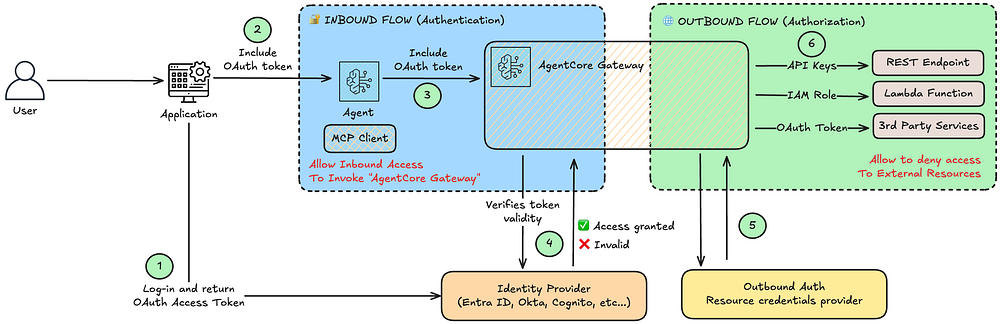

Memory Branching က စကားပြောဆိုမှုအတွင်း git branches လိုမျိုး သီးခြားခွဲထွက်စကားပြောဆိုမှု (branches) တွေကို ဖန်တီးပေးတာ ဖြစ်ပါတယ်ဗျာ။

## Example Architecture (ဥပမာ Architecture)

ကျွန်တော်တို့ ခရီးသွားလုပ်ငန်းအတွက် **Travel Planning System** တစ်ခုကို အောက်ပါ agent ၃ ခုနဲ့ ဆောက်ကြည့်ရအောင်ဗျာ -

1. **Travel Coordinator** (`main` branch) - တစ်ခုလုံးကို ဦးဆောင် စီစဉ်ပေးမယ့် agent
2. **Flight Booking Assistant** (`flight_agent_memory` branch) - လေယာဉ်လက်မှတ်အတွက် agent
3. **Hotel Booking Assistant** (`hotel_agent_memory` branch) - ဟိုတယ်အတွက် agent

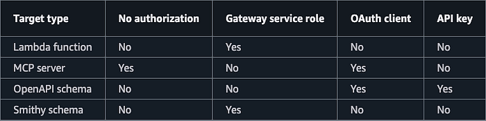

ဒီလိုစနစ်မှာ -
* Agents အားလုံးက တူညီတဲ့ `memory_id` နဲ့ `session_id` ကို သုံးကြပါတယ်။
* ဒါပေမယ့် agent တစ်ခုစီအတွက် သီးခြား `branch_name` သတ်မှတ်ပြီး context ခွဲခြားထားပါတယ်ဗျာ။

### Multi-Agent Systems အတွက် အဓိက အကျိုးကျေးဇူးများ -

* **Context Isolation:** လေယာဉ် agent က လေယာဉ်အကြောင်းပဲ မြင်ရပြီး၊ ဟိုတယ် agent က ဟိုတယ်အကြောင်းပဲ မြင်ရတာမို့လို့ context တွေ မရှုပ်ထွေးတော့ပါဘူးဗျာ။
* **Parallel Execution Safety:** Agent တွေ တစ်ပြိုင်နက်တည်း run တဲ့အခါ memory overwritten ဖြစ်တာမျိုး မရှိတော့ပါဘူး။
* **Clear Audit Trail:** Agent တစ်ခုချင်းစီ ဘာတွေပြောခဲ့သလဲဆိုတာကို သီးခြား debug လုပ်ပြီး ခြေရာခံနိုင်ပါတယ်ဗျ။

### How the Memory Hook Provider with Branch Support Works (Branch Support ပါဝင်သော Memory Hook Provider အလုပ်လုပ်ပုံ)

`ShortTermMemoryHook` class က multi-agent system မှာ branching စနစ်ကို အလိုအလျောက် တည်ဆောက်ပြီး စီမံခန့်ခွဲပေးတာ ဖြစ်ပါတယ်ဗျာ -

```python
class ShortTermMemoryHook(HookProvider):
    def __init__(self, memory_id: str, region_name: str = "us-west-2", branch_name: str = "main"):
        """Initialize the hook with a MemorySessionManager.

        Args:
            memory_id: The AgentCore Memory ID
            region_name: AWS region for the memory service
            branch_name: Branch name for this agent's memory (default: "main")
        """
        self.memory_manager = MemorySessionManager(
            memory_id=memory_id,
            region_name=region_name
        )
        self.memory_id = memory_id
        self.branch_name = branch_name
        self._sessions = {}  # Cache session objects per actor/session combo
        self._branch_initialized = False  # Track if branch has been created

    def _get_or_create_session(self, actor_id: str, session_id: str):
        """Get or create a MemorySession for the given actor/session.

        Args:
            actor_id: The actor identifier
            session_id: The session identifier

        Returns:
            MemorySession object
        """
        key = f"{actor_id}:{session_id}"
        if key not in self._sessions:
            self._sessions[key] = self.memory_manager.create_memory_session(
                actor_id=actor_id,
                session_id=session_id
            )
        return self._sessions[key]

    def _initialize_branch(self, actor_id: str, session_id: str):
        """Initialize a branch if it doesn't exist and this is not the main branch.

        Args:
            actor_id: The actor identifier
            session_id: The session identifier
        """
        if self._branch_initialized or self.branch_name == "main":
            return

        try:
            memory_session = self._get_or_create_session(actor_id, session_id)

            # Check if branch already exists
            branches = memory_session.list_branches()
            branch_exists = any(b.name == self.branch_name for b in branches)

            if not branch_exists:
                # Get the last event from main branch to fork from
                main_events = memory_session.list_events(branch_name="main")
                if main_events:
                    last_event = main_events[-1]
                    # Create the branch with an initial message
                    memory_session.fork_conversation(
                        root_event_id=last_event.eventId,
                        branch_name=self.branch_name,
                        messages=[
                            ConversationalMessage(f"Starting {self.branch_name} branch", MessageRole.ASSISTANT)
                        ]
                    )
                    logger.info(f"✅ Created branch: {self.branch_name}")

            self._branch_initialized = True

        except Exception as e:
            logger.error(f"Failed to initialize branch {self.branch_name}: {e}", exc_info=True)

    def on_agent_initialized(self, event: AgentInitializedEvent):
        """Load recent conversation history when agent starts"""
        try:
            # Get session info from agent state
            actor_id = event.agent.state.get("actor_id")
            session_id = event.agent.state.get("session_id")

            if not actor_id or not session_id:
                logger.warning("Missing actor_id or session_id in agent state")
                return

            # Get the memory session
            memory_session = self._get_or_create_session(actor_id, session_id)

            # For non-main branches, initialize if there are events in main branch
            if self.branch_name != "main":
                try:
                    main_events = memory_session.list_events(branch_name="main")
                    if len(main_events) > 0:
                        self._initialize_branch(actor_id, session_id)
                except Exception as e:
                    # Main branch might not exist yet on first call
                    logger.info(f"Main branch not found yet, will initialize {self.branch_name} branch later: {e}")

            # Check if the branch exists before trying to get turns
            branches = memory_session.list_branches()
            branch_exists = any(b.name == self.branch_name for b in branches)
            
            recent_turns = []
            if branch_exists:
                # Only fetch turns if branch exists
                recent_turns = memory_session.get_last_k_turns(
                    k=5,
                    branch_name=self.branch_name
                )
            else:
                logger.info(f"Branch '{self.branch_name}' does not exist yet, skipping turn retrieval")

            if len(recent_turns) > 0:
                # Format conversation history for context
                context_messages = []
                for turn in recent_turns:
                    for message in turn:
                        role = message.content.get('role', 'unknown').lower()
                        text = message.content.get('content', {}).get('text', '')
                        if text:
                            context_messages.append(f"{role.title()}: {text}")

                if context_messages:
                    context = "\n".join(context_messages)
                    logger.info(f"Loaded context from branch '{self.branch_name}' ({len(context_messages)} messages)")

                    # Add context to agent's system prompt
                    event.agent.system_prompt += (
                        f"\n\nRecent conversation history (from {self.branch_name}):\n{context}\n\n"
                        "Continue the conversation naturally based on this context."
                    )

                    logger.info(f"✅ Loaded {len(recent_turns)} recent conversation turns from branch '{self.branch_name}'")
            else:
                logger.info(f"No previous conversation history found in branch '{self.branch_name}'")

        except Exception as e:
            logger.error(f"Failed to load conversation history: {e}", exc_info=True)

    def on_message_added(self, event: MessageAddedEvent):
        """Store conversation turns in memory on the appropriate branch"""
        try:
            # Get session info from agent state
            actor_id = event.agent.state.get("actor_id")
            session_id = event.agent.state.get("session_id")

            if not actor_id or not session_id:
                logger.warning("Missing actor_id or session_id in agent state")
                return

            # Get the memory session
            memory_session = self._get_or_create_session(actor_id, session_id)

            # Get the last message
            messages = event.agent.messages
            if not messages:
                return

            last_message = messages[-1]
            role_str = last_message.get("role", "").upper()
            content_text = last_message.get("content", [{}])[0].get("text", "")

            if not content_text:
                logger.debug("Skipping empty message")
                return

            # Map role string to MessageRole enum
            role_mapping = {
                "USER": MessageRole.USER,
                "ASSISTANT": MessageRole.ASSISTANT,
                "TOOL": MessageRole.TOOL,
            }
            message_role = role_mapping.get(role_str, MessageRole.USER)

            # Store the message on the appropriate branch
            if self.branch_name == "main":
                # Main branch - just add turns normally
                memory_session.add_turns(
                    messages=[ConversationalMessage(content_text, message_role)]
                )
            else:
                # Non-main branch - need to append to existing branch
                # Initialize branch if it doesn't exist
                if not self._branch_initialized:
                    self._initialize_branch(actor_id, session_id)

                # Get the latest event from this branch
                branch_events = memory_session.list_events(branch_name=self.branch_name)
                if branch_events:
                    # Add to existing branch by specifying branch name (without rootEventId)
                    memory_session.add_turns(
                        messages=[ConversationalMessage(content_text, message_role)],
                        branch={"name": self.branch_name}
                    )
                else:
                    # This shouldn't happen if _initialize_branch worked, but handle it
                    logger.warning(f"Branch {self.branch_name} not found after initialization")
                    self._initialize_branch(actor_id, session_id)

            logger.debug(f"✅ Stored message in branch '{self.branch_name}': {role_str}")

        except Exception as e:
            logger.error(f"Failed to store message: {e}", exc_info=True)

    def create_branch(self, actor_id: str, session_id: str,
                      root_event_id: str, branch_name: str,
                      messages: list):
        """Create a new conversation branch.

        Args:
            actor_id: The actor identifier
            session_id: The session identifier
            root_event_id: Event ID to branch from
            branch_name: Name for the new branch
            messages: List of ConversationalMessage objects to add to the branch
        """
        memory_session = self._get_or_create_session(actor_id, session_id)
        return memory_session.fork_conversation(
            root_event_id=root_event_id,
            branch_name=branch_name,
            messages=messages
        )

    def list_branches(self, actor_id: str, session_id: str):
        """List all branches for a session.

        Args:
            actor_id: The actor identifier
            session_id: The session identifier

        Returns:
            List of branch information
        """
        memory_session = self._get_or_create_session(actor_id, session_id)
        return memory_session.list_branches()

    def get_session(self, actor_id: str, session_id: str):
        """Get the memory session object for direct access.

        Args:
            actor_id: The actor identifier
            session_id: The session identifier

        Returns:
            MemorySession object
        """
        return self._get_or_create_session(actor_id, session_id)

    def register_hooks(self, registry: HookRegistry) -> None:
        """Register memory hooks with the registry.

        Args:
            registry: The HookRegistry to register callbacks with
        """
        registry.add_callback(MessageAddedEvent, self.on_message_added)
        registry.add_callback(AgentInitializedEvent, self.on_agent_initialized)
```

ပြီးရင်တော့ agent တစ်ခုချင်းစီဆီ branch name တွေ သတ်မှတ်ပေးပါမယ်ဗျာ -

```python
def flight_booking_agent() -> Agent:
    global flight_memory_hooks
    try:
        if flight_memory_hooks is None:
            # Create hook with branch name "flight_agent_memory"
            flight_memory_hooks = ShortTermMemoryHook(
                memory_id=memory_id,
                region_name=region,
                branch_name="flight_agent_memory"
            )

        flight_agent = Agent(
            hooks=[flight_memory_hooks],
            model=MODEL_ID,
            system_prompt=FLIGHT_BOOKING_PROMPT,
            state={"actor_id": actor_id, "session_id": session_id}
        )
        return flight_agent
    except Exception as e:
        return f"Error in flight booking assistant: {str(e)}"

def hotel_booking_agent() -> Agent:
    global hotel_memory_hooks
    try:
        if hotel_memory_hooks is None:
            # Create hook with branch name "hotel_agent_memory"
            hotel_memory_hooks = ShortTermMemoryHook(
                memory_id=memory_id,
                region_name=region,
                branch_name="hotel_agent_memory"
            )

        hotel_booking_agent = Agent(
            hooks=[hotel_memory_hooks],
            model=MODEL_ID,
            system_prompt=HOTEL_BOOKING_PROMPT,
            state={"actor_id": actor_id, "session_id": session_id}
        )
        return hotel_booking_agent
```

### Building the Agent Graph with Parallel Execution Support (Parallel Execution စနစ်ပါဝင်သော Agent Graph တည်ဆောက်ခြင်း)

အခုဆိုရင် ကျွန်တော်တို့ရဲ့ agents တွေကို **Strands Agent Graph** တစ်ခုထဲ စုစည်းပြီး graph တည်ဆောက်နိုင်ပြီ ဖြစ်ပါတယ်ဗျာ။

```python
import logging
from strands import Agent
from strands.multiagent import GraphBuilder

# Enable debug logs and print them to stderr
logging.getLogger("strands.multiagent").setLevel(logging.DEBUG)
logging.basicConfig(
    format="%(levelname)s | %(name)s | %(message)s",
    handlers=[logging.StreamHandler()]
)

# Build the Strands Agent Graph
builder = GraphBuilder()

# Add nodes - each agent with its own memory branch
builder.add_node(travel_booking_agent(), "travel_agent")           # Uses 'main' branch
builder.add_node(flight_booking_agent(), "flight_booking_agent")   # Uses 'flight_agent_memory' branch
builder.add_node(hotel_booking_agent(), "hotel_booking_agent")     # Uses 'hotel_agent_memory' branch

# Add edges - define which agents the coordinator can delegate to
builder.add_edge("travel_agent", "flight_booking_agent")
builder.add_edge("travel_agent", "hotel_booking_agent")

# Set entry point
builder.set_entry_point("travel_agent")

# Configure execution limits for safety
builder.set_execution_timeout(600)   # 10 minute timeout

# Build the graph
graph = builder.build()
```

ကျွန်တော်တို့ရဲ့ agent graph မှာ အခုဆိုရင် -
* ✅ သီးခြား memory branches ပါဝင်တဲ့ agents ၃ ခု ရှိလာပါတယ်။
* ✅ Strands Agent Graph ကတစ်ဆင့် parallel execution လုပ်ဆောင်နိုင်ပါတယ်။
* ✅ AgentCore Memory Branching ကြောင့် memory တိုက်မိခြင်း မရှိတော့ပါဘူးဗျာ။

## Amazon Bedrock AgentCore Identity: Provide identity management for agent applications (Agent Applications များအတွက် Identity စီမံခန့်ခွဲမှု)

Amazon Bedrock AgentCore Identity ဆိုတာကတော့ AI agents တွေနဲ့ automated workloads တွေအတွက် တည်ဆောက်ထားတဲ့ identity နဲ့ credential management service တစ်ခု ဖြစ်ပါတယ်ဗျာ။

သူ့ရဲ့ အဓိက လုပ်ဆောင်ချက်တွေကတော့ -
1. User တွေကို agent တွေ ခေါ်ယူသုံးစွဲနိုင်အောင် ဆောင်ရွက်ပေးခြင်း
2. Agent တွေကို user ကိုယ်စား external resources နဲ့ services တွေကို လုံခြုံစွာ ဝင်ရောက်သုံးစွဲနိုင်အောင် ဆောင်ရွက်ပေးခြင်း

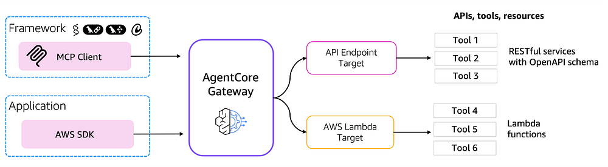

အဓိက features တွေကတော့ -
* **Inbound Authentication:** Agent တွေကို လှမ်းခေါ်တဲ့ user သို့မဟုတ် app ကို စစ်ဆေးပေးခြင်း
* **Outbound Authentication:** Agent က ပြင်ပ resources တွေကို သွားခေါ်တဲ့အခါ user ကိုယ်စား လုံခြုံစွာ ခေါ်ပေးခြင်း
* **OAuth Integration:** 2-legged နဲ့ 3-legged OAuth flows တွေကို support ပေးခြင်း
* **AWS IAM Integration:** AWS IAM နဲ့ အလွယ်တကူ တွဲသုံးနိုင်ခြင်း
* **Zero Trust Security:** ဝင်လာတဲ့ request တိုင်းကို စနစ်တကျ ပြန်လည်စစ်ဆေးခြင်း ဖြစ်ပါတယ်ဗျာ။

## Authentication Types (စစ်ဆေးမှု အမျိုးအစားများ)

### Inbound Auth
AgentCore Runtime သို့မဟုတ် Gateway ဆီကို လှမ်းခေါ်တဲ့ request တွေကို စစ်ဆေးတာ ဖြစ်ပါတယ်ဗျာ။
* **AWS IAM:** IAM-based access control သုံးလို့ရပါတယ်။
* **OAuth:** Token-based authentication ကို သုံးနိုင်တာမို့လို့ user တွေ IAM permissions ရှိစရာ မလိုပါဘူးဗျာ။

### Outbound Auth
Agent က ပြင်ပ ဝန်ဆောင်မှုတွေကို ဝင်ရောက်သုံးစွဲဖို့ စစ်ဆေးပေးတာ ဖြစ်ပါတယ်ဗျ။
* **AWS Resources:** IAM execution roles ကို သုံးပါတယ်။
* **External Services:** OAuth 2-legged သို့မဟုတ် 3-legged flows ကို သုံးနိုင်ပါတယ်ဗျာ။

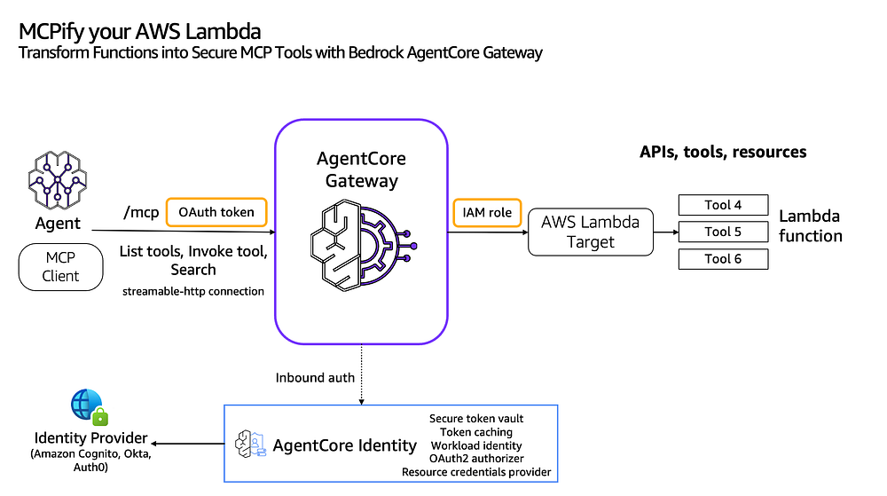

### အလုပ်လုပ်ပုံအဆင့်ဆင့် -

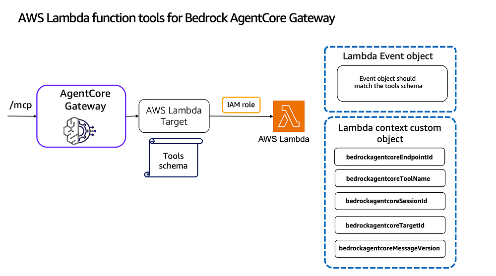

1. **User Authentication:** User က login ဝင်ပါတယ်။
2. **Agent Authorization:** App က user tokens တွေကို သုံးပြီး agent ကို လှမ်းခေါ်ပါတယ်။
3. **Token Exchange:** AgentCore Identity က user token ကို စစ်ဆေးပြီး workload access token ကို ထုတ်ပေးပါတယ်။
4. **Resource Access:** Agent က workload token ကိုသုံးပြီး အလုပ်လုပ်ပါတယ်။
5. **Delegation & Audit:** လုပ်ဆောင်ချက်တိုင်းကို သေချာမှတ်တမ်းတင် (audit) ထားပါတယ်ဗျာ။

ဥပမာ - agent က user ကိုယ်စား Google Calendar မှာ meeting သွား schedule လုပ်တဲ့အခါ၊ user က login ဝင်ပြီး authorization token ပေးလိုက်ရင် agent က workload token နဲ့ calendar API ကို user ကိုယ်စား အလုပ်လုပ်ပေးသွားမှာ ဖြစ်ပါတယ်လေ။

## Tagging AgentCore Identity resources (Identity Resources များအား Tags သတ်မှတ်ခြင်း)

AgentCore Identity မှာ access control တွေ၊ resource management တွေနဲ့ cost management တွေ ကောင်းမွန်စေဖို့ tags တွေကို အသုံးပြုနိုင်ပါတယ်ဗျာ။

### Control access based on tags (Tags ပေါ်အခြေခံ၍ Access စီမံခြင်း)

IAM policies တွေထဲမှာ conditional tags တွေထည့်ပြီး Attribute-Based Access Control (ABAC) ကို အသုံးပြုနိုင်ပါတယ်ဗျာ။

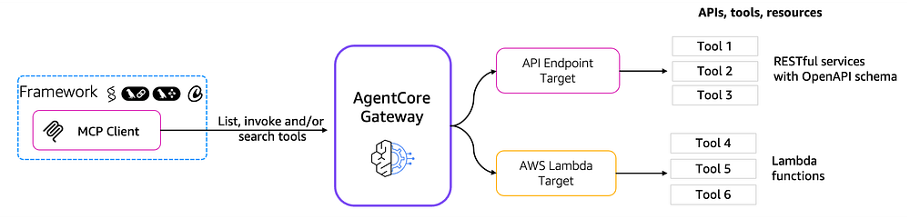

ဥပမာ policy ဖော်ပြချက်လေးပါဗျ -

```json
{
  "Version": "2012-10-17",       
  "Statement": [
    {
      "Effect": "Allow",
      "Action": [
        "bedrock-agentcore:GetWorkloadIdentity",
        "bedrock-agentcore:UpdateWorkloadIdentity"
      ],
      "Resource": "*",
      "Condition": {
        "StringEquals": {
          "bedrock-agentcore:ResourceTag/Owner": "${aws:PrincipalTag/Team}"
        }
      }
    }
  ]
}
```

## Amazon Bedrock AgentCore Gateway: Securely connect tools and other resources to your Gateway (Gateway အား Tools နှင့် ချိတ်ဆက်ပေးခြင်း)

Bedrock AgentCore Gateway ဟာ သင့်ရဲ့ လက်ရှိ APIs သို့မဟုတ် Lambda functions တွေကို infrastructure တွေ host တွေ စီမံခန့်ခွဲစရာမလိုဘဲ fully-managed MCP servers တွေအဖြစ် အလွယ်တကူ ပြောင်းလဲပေးနိုင်တဲ့ ဝန်ဆောင်မှု ဖြစ်ပါတယ်ဗျာ။

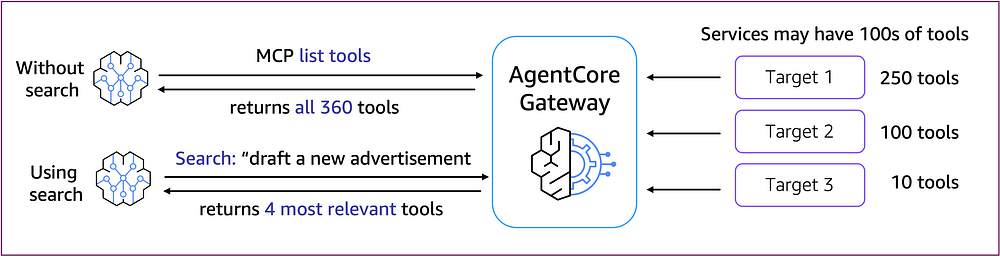

Gateway က လုံခြုံရေးအတွက် dual authentication model ကို သုံးပါတယ်ဗျာ -
* **Inbound Auth:** Gateway ဆီ လာမယ့် requests တွေကို စစ်ဆေးပေးပါတယ်။
* **Outbound Auth:** Backend resources (ဥပမာ- Lambda) ကို သွားခေါ်တဲ့အခါ user ကိုယ်စား authentication လုပ်ပေးပါတယ်။

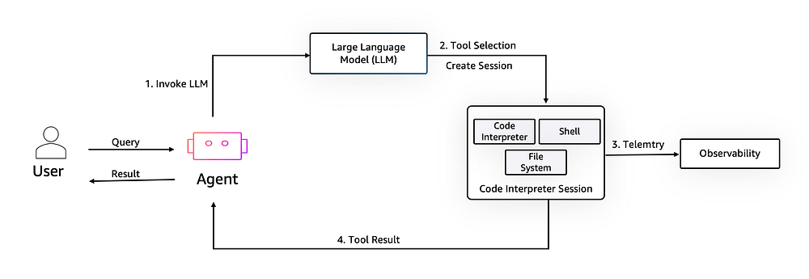

### Available outbound authorization for the gateway (အသုံးပြုနိုင်သော Outbound Auth အမျိုးအစားများ)

Gateway targets တွေကို သွားခေါ်တဲ့အခါ အောက်ပါအမျိုးအစားတွေကို သုံးနိုင်ပါတယ်ဗျာ -
* **No authorization (မထောက်ခံပါ):** စစ်ဆေးမှု လုံးဝမလုပ်ဘဲ ကျော်သွားတာဖြစ်လို့ လုံခြုံရေးအတွက် မသုံးသင့်ပါဘူးဗျာ။
* **IAM-based outbound authorization:** AWS Sig V4 သုံးပြီး IAM role နဲ့ ချိတ်ဆက်ပါတယ်။
* **2-legged OAuth (OAuth 2LO):** OAuth 2.0 စနစ်သုံးပြီး ချိတ်ဆက်တာ ဖြစ်ပါတယ်ဗျ။
* **API key:** AgentCore ကနေ generate လုပ်ထားတဲ့ API key နဲ့ ချိတ်ဆက်ပါတယ်။

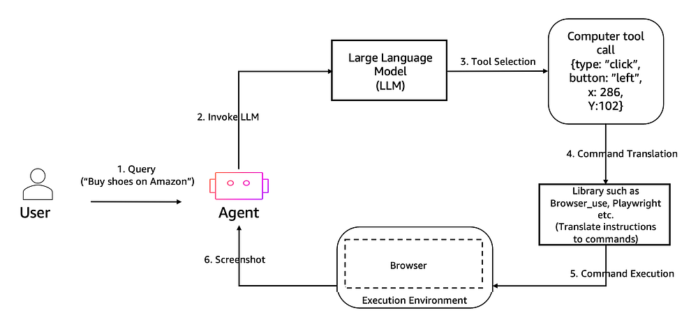

### Core Concepts (အဓိက အယူအဆများ)

* **Amazon Bedrock AgentCore Gateway:** Boto3 သို့မဟုတ် MCP client နဲ့ လှမ်းခေါ်နိုင်မယ့် gateway endpoint ဖြစ်ပါတယ်ဗျာ။
* **Bedrock AgentCore Gateway Target:** Gateway နဲ့ ချိတ်ဆက်ထားတဲ့ backend resource (ဥပမာ - Lambda ARNs သို့မဟုတ် API specs) ဖြစ်ပါတယ်ဗျာ။
* **MCP Transport:** Message တွေ ဘယ်လိုသွားမလဲဆိုတာ သတ်မှတ်ပေးပြီး၊ လက်ရှိမှာတော့ `Streamable HTTP connections` ကိုပဲ support ပေးထားပါတယ်ဗျာ။

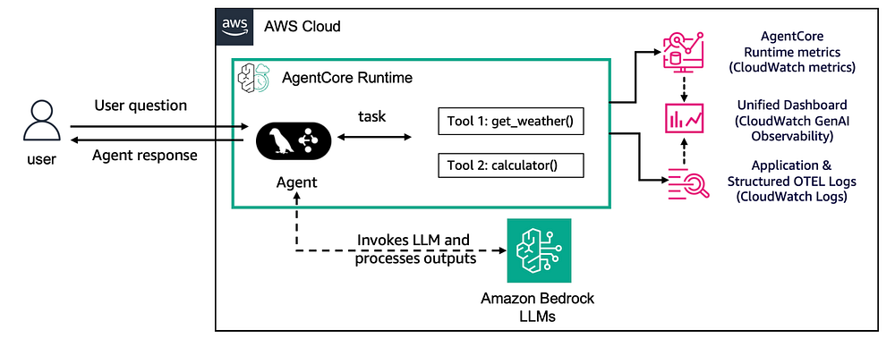

### Implement Lambda function tools for Gateway (Gateway အတွက် Lambda Function Tools များ ရေးသားခြင်း)

Lambda functions တွေကို tools တွေအဖြစ် gateway မှာ ချိတ်ဆက်သုံးတဲ့အခါ gateway က `context.client_context` ကနေတစ်ဆင့် သက်ဆိုင်ရာ metadata (ဥပမာ- session ID, tool name) တွေကို အလိုအလျောက် ပေးပို့ပေးပါတယ်ဗျာ။

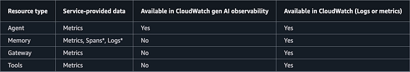

အောက်ပါ properties တွေကို customize logic တွေ ရေးတဲ့အခါ သုံးနိုင်ပါတယ်ဗျ -
* `bedrockagentcoreEndpointId`
* `bedrockagentcoreTargetId`
* `bedrockagentcoreMessageVersion`
* `bedrockagentcoreToolName` (ဘယ် tool ကို invoke လုပ်နေလဲ သိဖို့အတွက် အင်မတန် အရေးကြီးပါတယ်ဗျာ)
* `bedrockagentcoreSessionId`


Lambda target schema ကို MCP tools definition အဖြစ် သတ်မှတ်ပုံ ဥပမာလေးပါဗျ -

```python
lambda_target_config = {
    "mcp": {
        "lambda": {
            "lambdaArn": lambda_resp['lambda_function_arn'], # Replace this with your AWS Lambda function ARN
            "toolSchema": {
                "inlinePayload": [
                    # Tool_1: get_order_tool
                    {
                        "name": "get_order_tool",
                        "description": "tool to get the order",
                        "inputSchema": {
                            "type": "object",
                            "properties": {
                                "orderId": {
                                    "type": "string"
                                }
                            },
                            "required": ["orderId"]
                        }
                    },
                    # Tool_2: update_order_tool                    
                    {
                        "name": "update_order_tool",
                        "description": "tool to update the orderId",
                        "inputSchema": {
                            "type": "object",
                            "properties": {
                                "orderId": {
                                    "type": "string"
                                }
                            },
                            "required": ["orderId"]
                        }
                    }
                ]
            }
        }
    }
}

# Define outbound authorization to allow for lambda invoking after you authenticate with the gateway
credential_config = [ 
    {
        # Authorization using the AgentCore Gateway assigned IAM Role
        "credentialProviderType" : "GATEWAY_IAM_ROLE"
    }
]

targetname='LambdaUsingSDK'
response = gateway_client.create_gateway_target(
    gatewayIdentifier=gatewayID,
    name=targetname,
    description='Lambda Target using SDK',
    targetConfiguration=lambda_target_config,
    credentialProviderConfigurations=credential_config
)
```

## Gateway Semantic Search (Gateway အတွက် Semantic Search အသုံးပြုခြင်း)

အဖွဲ့အစည်းကြီးတွေမှာ tools တွေ ရာနဲ့ချီ သို့မဟုတ် ထောင်နဲ့ချီ ရှိတတ်ပါတယ်ဗျာ။ ဒါတွေအကုန်လုံးကို LLM ဆီ တစ်ခါတည်းပို့ရင် token costs များပြီး performance နှေးစေပါတယ်ဗျ။


AgentCore Gateway က tools တွေပေါ်မှာ **built-in semantic search** စနစ်ကို ပေးထားတာကြောင့်၊ agent မေးလာတဲ့ မေးခွန်းနဲ့ တကယ်သက်ဆိုင်တဲ့ tools တွေကိုပဲ ရွေးချယ်ပေးနိုင်လို့ latency ကို 3x အထိ ပိုမြန်စေပါတယ်ဗျာ။


---

## Amazon Bedrock AgentCore Built-in Tools: Interact with your applications using built-in tools (ပါရှိပြီးသား Built-in Tools များ)

အဓိကအားဖြင့် Built-in Tools နှစ်ခု ပါဝင်ပါတယ်ဗျ -
* Amazon Bedrock AgentCore **Code Interpreter**
* Amazon Bedrock AgentCore **Browser Tool**

## Execute code and analyze data using Amazon Bedrock AgentCore Code Interpreter (Code Interpreter အသုံးပြုခြင်း)

ဒီ tool က agent တွေကို လုံခြုံစိတ်ချရတဲ့ container environment (sandbox) ထဲမှာ code ရေးပြီး run နိုင်အောင် လုပ်ဆောင်ပေးပါတယ်ဗျာ။ ဒါကြောင့် လုံခြုံရေးစိုးရိမ်ရတဲ့ ကုဒ်တွေကိုတောင် စိတ်ချလက်ချ execute လုပ်စေနိုင်ပါတယ်လေ။


Python, JavaScript, TypeScript စတဲ့ ဘာသာစကားတွေကို support လုပ်ပေးပြီး၊ Amazon S3 မှာရှိတဲ့ csv, excel သို့မဟုတ် json data တွေကို process လုပ်ဖို့လည်း သုံးနိုင်ပါတယ်ဗျာ။

Code Interpreter သုံးတဲ့ code ဥပမာလေးပါဗျ -

```python
from strands import Agent
from strands_tools.code_interpreter import AgentCoreCodeInterpreter

# Initialize the Code Interpreter tool
code_interpreter_tool = AgentCoreCodeInterpreter(region="<Region>")

# Define the agent's system prompt
SYSTEM_PROMPT = """You are an AI assistant that validates answers through code execution.
When asked about code, algorithms, or calculations, write Python code to verify your answers."""

# Create an agent with the Code Interpreter tool
agent = Agent(
    tools=[code_interpreter_tool.code_interpreter],
    system_prompt=SYSTEM_PROMPT
)

# Test the agent with a sample prompt
prompt = "Calculate the first 10 Fibonacci numbers."
print(f"\n\nPrompt: {prompt}\n\n")

response = agent(prompt)
print(response.message["content"][0]["text"])
```

## Interact with web applications using Amazon Bedrock AgentCore Browser (Browser Tool အသုံးပြုခြင်း)

Browser tool ကတော့ cloud ပေါ်မှာရှိတဲ့ လုံခြုံတဲ့ browser ကနေတစ်ဆင့် web pages တွေဖတ်ဖို့၊ data တွေ ယူဖို့ လုပ်ဆောင်ပေးပါတယ်ဗျာ။


* **Automation:** Navigation, clicks, form-filling, screenshots စတာတွေကို လုပ်ဆောင်ပေးပါတယ်။
* **Live View:** User အနေနဲ့ browser စားပွဲတင်ပေါ်မှာ ဘာလုပ်နေလဲဆိုတာကို live စောင့်ကြည့်ပြီး interaction လုပ်နိုင်ပါတယ်ဗျာ။
* **Recording:** စုံစမ်းစစ်ဆေးဖို့နဲ့ debug လုပ်ဖို့အတွက် web sessions တွေကို record လုပ်ပြီး S3 ထဲ သွားသိမ်းပေးပါတယ်ဗျ။

Browser သုံးတဲ့ code ဥပမာလေးပါဗျ -

```python
from strands import Agent
from strands_tools.browser import AgentCoreBrowser

# Initialize the Browser tool
browser_tool = AgentCoreBrowser(region="<Region>")

# Create an agent with the Browser tool
agent = Agent(tools=[browser_tool.browser])

# Test the agent with a web search prompt
prompt = "what are the services offered by Bedrock AgentCore? Use the documentation link if needed: https://docs.aws.amazon.com/bedrock-agentcore/latest/devguide/what-is-bedrock-agentcore.html"
print(f"\n\nPrompt: {prompt}\n\n")

response = agent(prompt)
print("\n\nAgent Response:")
print(response.message["content"][0]["text"])
```

## Amazon Bedrock AgentCore Observability: Observe your agents and resources (Agent များအား စောင့်ကြည့်လေ့လာခြင်း)

AgentCore Observability က production ထဲက agents တွေရဲ့ latency, token usage, durations နဲ့ error rates တွေကို Amazon CloudWatch logs နဲ့ OpenTelemetry (OTEL) formats တွေသုံးပြီး စောင့်ကြည့် စစ်ဆေးနိုင်အောင် လုပ်ဆောင်ပေးပါတယ်ဗျာ။


### AgentCore Gateway CloudWatch Tracing (CloudWatch Tracing စနစ်)

Tracing ကို enable လုပ်ထားရင် gateway ကနေတစ်ဆင့် request တစ်ခုချင်းစီရဲ့ execution flow ကို အသေးစိတ် စစ်ဆေးနိုင်မှာ ဖြစ်ပါတယ်ဗျာ။

* **Traces (အမြင့်ဆုံးအဆင့်):** စကားပြောဆိုမှု တစ်ခုလုံးကို ကိုယ်စားပြုပါတယ်။
* **Requests (အလယ်အဆင့်):** Agent ကို တစ်ကြိမ် invoke လုပ်ခြင်းကို ကိုယ်စားပြုပါတယ်။
* **Spans (အသေးစိတ်အဆင့်):** Tool execution သို့မဟုတ် API call တစ်ခုချင်းစီရဲ့ ကြာမြင့်ချိန်ကို တိကျစွာ ပြသပေးပါတယ်ဗျာ။

```
Trace 1
      ├── Request 1.1
      │   ├── Span 1.1.1
      │   ├── Span 1.1.2
      │   └── Span 1.1.3
      ├── Request 1.2
      │   ├── Span 1.2.1
      │   ├── Span 1.2.2
      │   └── Span 1.2.3
      └── Request 1.N
```

---

## References (ကိုးကားချက်များ)

* [**Original Blog Post (Medium)**](https://joudwawad.medium.com/aws-bedrock-agentcore-deep-dive-6822e4071774#f704)
* [**AWS Bedrock AgentCore Documentation**](https://docs.aws.amazon.com/bedrock-agentcore/latest/devguide/agentcore-get-started-toolkit.html)
* [**AWS Bedrock AgentCore Github Repo**](https://github.com/awslabs/amazon-bedrock-agentcore-samples)

---

## Conclusion (နိဂုံး)

Amazon Bedrock AgentCore ဟာ framework တစ်ခုထက်မကဘဲ prototype အဆင့်ရှိတဲ့ AI agents တွေကို production အဆင့် စိတ်ချရတဲ့ ဝန်ဆောင်မှုတွေအဖြစ် ပြောင်းလဲပေးနိုင်တဲ့ အခြေခံအုတ်မြစ် ဖြစ်ပါတယ်ဗျာ။ runtime orchestration, tool integration, identity control, memory handling နဲ့ observability တွေကို fully-managed ပံ့ပိုးပေးထားတာကြောင့်၊ backend infrastructure တွေအတွက် အချိန်ပေးစရာမလိုဘဲ အဆင့်မြင့် AI applications တွေကို လျင်မြန်စွာ တည်ဆောက်နိုင်မှာ ဖြစ်ပါတယ်ဗျ။

ဒီ deep dive post ကနေပြီးတော့ အတိုင်းအတာကြီးမားတဲ့ လုပ်ငန်းခွင်တွေမှာ AI agents တွေ တည်ဆောက်တဲ့အခါ ကြုံတွေ့ရလေ့ရှိတဲ့ လုံခြုံရေး၊ scale, state management စတဲ့ စိန်ခေါ်မှုတွေကို AgentCore က ဘယ်လိုဖြေရှင်းပေးသလဲဆိုတာကို ကောင်းစွာ သဘောပေါက်နားလည်သွားလိမ့်မယ်လို့ မျှော်လင့်ပါတယ်ခင်ဗျာ။ အားလုံးပဲ အဆင်ပြေကြပါစေဗျာ!
